# Building AI Agent with ADK
### Go Meetup 2026 @ Arise by Infinitas

**20 มี.ค. 2026 — ADK Go 1.0:** GA  
**30 มิ.ย. 2026 — ADK Go 2.0:** graph workflow, Task API

Pallat Anchaleechamaikorn

<!--
เนื่องจากช่วงนี้เราโม้กันเรื่องใครใช้ AI กันท่าไหนบ้างจนคนอาจจะเริ่มเลี่ยนกันบ้างแล้ว
ผมก็เลยชวนกลับมาคุยว่า ในมุมของการสร้าง AI Agent เองด้วย Go ตอนนี้มันทำได้แค่ไหนแล้ว
และเครื่องมืออะไรบ้างที่น่าสนใจ

hook เปิด: ADK Go 2.0 เพิ่งออก 30 มิ.ย. 2026 (verify จาก official Google Developers Blog "Announcing ADK Go 2.0") — ของจริง ไม่ใช่ hype
GA = General Availability (v1.0.0 ออก 20 มี.ค. 2026 — ผ่านจุดที่ Google การันตี API stability/production-ready แล้ว)
Task API คือ 3 modes ที่ agent แม่มอบงานให้ agent ลูกได้: Chat (คุยกับ user ได้เต็ม), Task (ถามกลับ user ได้เพื่อ clarify แล้ว return ให้ parent เอง), SingleTurn (รันจบในตัวเอง ไม่ถาม user เลย) — ถ้ามีคนถามใน Q&A ตอบสั้นๆ ได้ ไม่ต้องลงลึกเพราะไม่ใช่แก่นของ talk นี้

[Q&A cheat sheet — Task API ลึกขึ้น ถ้าโดนถามต่อ]

แกนที่ต่างจริงระหว่าง 3 mode คือ 2 อย่าง: (1) subagent คุยกับ user ได้แค่ไหน (2) control กลับ coordinator เองไหม
- Chat — คุยกับ user ได้ไม่จำกัด, กลับไม่การันตี ต้องรอ subagent ตัดสินใจเรียก transfer_to_agent เอง (ถ้าไม่เรียก ก็คุมบทสนทนาต่อไปเรื่อยๆ) — เหมาะกับ "โอนสายให้ specialist ไปเลย" งานเปิดกว้างไม่รู้ต้องคุยกี่รอบ
- Task — คุยกับ user ได้แค่ถาม clarify, กลับการันตี — พอ subagent เรียก finish_task() ระบบดึง control กลับ coordinator เองทันที — เหมาะกับงาน scope ชัดเจน จบแล้วจบเลย
- SingleTurn — คุยกับ user ไม่ได้เลย, กลับทันทีหลัง 1 turn, รันขนานกับ single-turn agent ตัวอื่นได้ — เหมาะกับ pure computation/lookup

ระวังจุดสับสนที่เคยงงเอง: "auto-gen delegation tool" (tool ชื่อตาม subagent ที่ coordinator ได้ฟรีตอนใส่ subagent เข้า SubAgents) เกิดกับ**ทุก mode เหมือนกันหมด** ไม่ใช่แค่ Task mode — สิ่งที่ Task mode พิเศษคือ auto-return ผ่าน finish_task() เท่านั้น อย่าพูดผสมสองเรื่องนี้เป็นเรื่องเดียวบนเวที

โค้ดจริง เขียนเหมือนกันเกือบหมด ต่างกันแค่ field เดียว: `Mode: llmagent.ModeChat / ModeTask / ModeSingleTurn` ใน llmagent.Config
ถ้าไม่เขียน Mode เลย ไม่ได้แปลว่าไม่มี mode — fallback อัตโนมัติ: เป็น sub-agent → default ModeChat, เป็น node ในกราฟ (v2.0) → default ModeSingleTurn (verify จาก pkg.go.dev/google.golang.org/adk/v2/agent/llmagent)

ตัวอย่างสั้นถ้าต้องยกให้ฟัง (trip_planner coordinator): itinerary_advisor=Chat (วางแผนเที่ยวเปิดกว้าง), flight_booker=Task (จองตั๋ว ถามแค่ economy/business แล้วจบ), currency_converter=SingleTurn (แปลงสกุลเงิน ไม่ต้องถามใคร)
ระวัง: อย่าพูดว่า ADK "ฆ่า" LangChain/LangGraph — เป็นคำ hype จากบทความ marketing ไม่ใช่คำที่ Google พูดเอง ไม่ verify ได้

แผนเวลา 30 นาที (25 slides — ต้องคุม pace):
- Live demo เปิดหัว (~1 นาที, ไม่เกิน) + ADK คืออะไร + Google ADK (Go) + A2A Protocol: ~6-7 นาที (อย่าจมกับ low-code debate ตรงนี้ — เก็บไว้ตอบ Q&A)
- แนวคิด 4 ข้อ + ภาพรวม 3 types + Tools/Sessions/Callbacks: ~5 นาที
- LLM Agent + โค้ด 2 หน้า: ~6 นาที (ไฮไลต์ของ talk)
- Workflow Agent + โค้ด 2 หน้า: ~5 นาที
- Custom Agent + โค้ด + ask-yield + iter.Seq2 (+ compiler desugar): ~7 นาที (iter.Seq2 คือจุดที่ Go audience ชอบสุด อย่าตัด)
- Architecture + Event + Timeline + Graph v2: ~3-4 นาที + Q&A
ถ้าเวลาไม่พอ ตัดตามลำดับนี้: (1) A2A Protocol slide ตัดทั้งสไลด์ได้เลย ไม่กระทบแก่น talk (2) Version Timeline พูดแค่ v1.0 GA กับ v2.0 breaking 30 วิ (3) Event slide ชี้แค่ 4 หมวดไม่ลง detail (4) Architecture ย่อเหลือประโยคเดียว "ได้ 3 อย่างนี้ฟรี"
ห้ามตัด: โค้ด 3 types กับ iter.Seq2 — คือแก่นของ talk สำหรับ Go meetup
-->

---
layout: "cover"
background: "linear-gradient(135deg, #1e3a8a 0%, #0f172a 100%)"
color: "#ffffff"
---

# ดูตัวจริงกันก่อน

*(สลับไป terminal — live demo)*

```
go run . console
```

<!--
LIVE DEMO — สลับไป terminal จริง ไม่ต้องมี slide content เพิ่ม

รันอะไร: examples/adk-custom-agent (repo github.com/pallat/adk) — `go run . console` แล้วพิมพ์อะไรก็ได้ 1 บรรทัด ดู event stream ยิงออกมา 3 event
ทำไมใช้ตัวนี้เปิด: ไม่ต้องมี GEMINI_API_KEY (ไม่พึ่ง network/LLM call) — ความเสี่ยง fail ต่ำสุดในบรรดา example ทั้งหมด เหมาะสุดสำหรับช่วงเปิดที่ยังไม่ warm up

พูดระหว่าง demo (~45 วิ - 1 นาที ไม่เกินนี้):
"ยังไม่ต้องเข้าใจตอนนี้ว่า event 3 อันนี้คืออะไร — เดี๋ยวจบ talk จะย้อนมาดูโค้ดตัวเดียวกันนี้อีกที แล้วจะเข้าใจว่าทำไมมันขึ้นแบบนี้"
(ปูให้ audience รู้ว่ามีจุดจบมาบรรจบ — สร้างแรงจูงใจให้ตามฟังทั้ง talk)

Pre-talk checklist (ทำก่อนขึ้นเวที ไม่ใช่ก่อนพูดสไลด์นี้):
1. cd เข้า examples/adk-custom-agent แล้ว `go build .` ล่วงหน้า (warm up binary cache กัน compile ช้าตอนสด)
2. เพิ่ม terminal font size ให้คนหลังห้องอ่านออก
3. เตรียมข้อความจะพิมพ์ไว้ล่วงหน้าในใจ (อย่า improvise สด เสี่ยง typo/พิมพ์อะไรแปลกๆ ที่ agent ตอบไม่สวย)
4. เปิด terminal ทิ้งไว้ tab/window พร้อมสลับ ก่อนขึ้นพูด cover slide แรก (ประหยัดเวลา alt-tab หน้างาน)

Fallback ถ้า demo พังสด (build error/terminal ค้าง/จอไม่ขึ้น): อย่า debug สดหน้าเวที เสียเวลา+เสีย flow — พูดข้ามทันที "เดี๋ยวเรามาดูโค้ดตัวนี้กันแบบ step-by-step แทน" แล้วไปต่อสไลด์ถัดไปเลย ไม่ต้อง apologize ยืดยาว
แนะนำ: เตรียม screenshot ของ output จริง (ถ่ายไว้ตอนซ้อม) เก็บเป็น backup image ไม่ต้องขึ้นจอเปล่าเปล่าถ้า live พัง — ยังไม่ได้ทำไฟล์ภาพ ถ้าต้องการให้ช่วย เตรียม asset นี้บอกได้
-->

---
layout: "cover"
background: "linear-gradient(135deg, #1e3a8a 0%, #0f172a 100%)"
color: "#ffffff"
---

# ADK คืออะไร?

Framework จาก Google สำหรับสร้าง **stateful AI agent**

แบบ **code-first** (ไม่ใช่ low-code / drag-drop)

มีให้เลือก 4 ภาษา: **Python · Java · Go · TypeScript**

<!--

code-first: ไม่ชอบ UI ดูแล้วเหนื่อย ต้องเรียนรู้, code ทำ unit test เข้า SDLC ได้เลย อยู่กับ stack เดิมของเรา

Python (ตัวแรก เม.ย. 2025) → Java → Go (7 พ.ย.) → TypeScript
core concept (Agent/Tool/Session) เหมือนกันหมดทุกภาษา ต่างแค่ syntax

-->

---
layout: "default"
background: "#0f172a"
color: "#f8fafc"
---

# Google ADK (Go)

- Multi-agent orchestration แบบ parent-child delegation
- Primitives: sequential, parallel, loop agent
- Native OpenTelemetry tracing
- MCP + A2A (Agent-to-Agent) protocol support
- Gemini-optimized แต่ใช้ model อื่นได้ (model-agnostic)

**เหมาะกับ:** enterprise ที่ flow ซับซ้อนขึ้นเรื่อยๆ — ต้อง testable, version-control ได้, integrate เข้า SDLC เดิม

<!--
[SCRIPT — พูดตามบรรทัดนี้]
จากที่คุยไปว่า ADK เป็น code-first framework ทีนี้มาเจาะเฉพาะฝั่ง Go กัน

ตัวมันรองรับ multi-agent orchestration แบบ parent-child — agent หลักมอบงานให้ agent ลูกได้ พร้อม primitive สำเร็จรูป 3 แบบให้คุมลำดับงาน: sequential, parallel, loop

มี OpenTelemetry tracing ติดมาให้เลย ไม่ต้องต่อเอง เห็น trace ทุก step ของ agent

รองรับทั้ง MCP กับ A2A protocol — MCP ไว้คุยกับ tool, A2A ไว้คุยข้าม agent ข้าม process (เดี๋ยวมีสไลด์ขยายให้ดู)

ฝั่ง model optimize มากับ Gemini แต่ใช้ model ค่ายอื่นได้ ไม่ผูกติด

สรุปคือเหมาะกับงาน enterprise ที่ flow ซับซ้อนขึ้นเรื่อยๆ ต้องการ testable, version-control ได้, integrate เข้า SDLC เดิม

[transition ไป low-code — โทน "ทางเลือก" ไม่ใช่ "ดีกว่าเดียว"]
feature พวกนี้ low-code ก็ทำได้เกือบหมดนะ ไม่ได้บอกว่า low-code ทำไม่ได้ เป็นแค่ทางเลือกคนละแบบ ถ้างานซับซ้อนมากๆ นั่งวาด node บางทีเห็นภาพง่ายกว่าเขียนโค้ดด้วยซ้ำ — แต่พอ scale ยาวๆ ต้อง maintain/test/debug/integrate เข้า SDLC เดิม ฝั่งเขียนโค้ดจะเริ่มถูกกว่า

[NOTE เดิม — draft ดิบ]
low-code ทำของอย่าง claude-code หรือพวก CLI ไม่ได้นะ

CLI มันระกับ system-level access แต่ถ้า low-code มันเป็น workflow ต้องรันอยู่ใน execution engine

CLI ทำเสร็จแล้วแจก tool ไปติดตั้งเองที่เครื่องได้เลย

feature เหล่านี้ low-code ทำได้หมดอยู่แล้ว ตัวนี้เป็นทางเลือก

low-code ยังได้เปรียบเวลาเจองานที่ซับซ้อนมากๆ เขียนโค้ดมันยิ่งยาก low-code เวลาเห็นภาพมันจะง่ายกว่า

แต่ถ้าในระยะยาว เขียน code ไปเลยก็ดีนะ คิดว่า low-code  maintain/test/debug/integrate SDLC จะยิ่งแพงขึ้น

[Q&A backup ด้านล่าง — ไม่ต้องพูดสด ใช้ตอบคำถามเท่านั้น]

**Q: low-code ทำ multi-agent/test/guardrail ได้ไหม?** (defensive answer — nuanced ไม่ใช่ absolute — ระวังคนฟังที่รู้จัก n8n/Dify/Flowise/Coze)

**คำตอบหลัก:** ได้แล้วจริง (ปี 2026 branching/parallel/loop node ทำได้หมด) — จุดต่างจริงคือ **maintainability ตอน scale ขึ้น** ไม่ใช่ capability วันแรก

**scale กันคนละแกน** (ไม่มีใครชนะเบ็ดเสร็จ ขึ้นกับ use case):
- low-code scale กว้าง — คนสร้างเยอะ, execution infra auto-scale เอง
- code-first scale ลึก — ความซับซ้อนใน flow เดียว, governance/audit ระยะยาว
- logic ซับซ้อนมาก (nested state, dynamic condition) → วาด node graph ยุ่งเละเร็วกว่าเขียนโค้ด

**test** — เช็คแล้ว ก.ค. 2026, low-code ปิดช่องว่างไปเยอะแล้ว อย่า overclaim ว่า "ทำไม่ได้"
- มีแล้ว: Dify (test node แยก isolated + log history + version control ในตัว), n8n (pin data mock input + evaluation node เทียบ output + ต่อ CI/CD ผ่าน webhook)
- ยังต่างจริง: ไม่ใช่ assertion-based unit test framework (Jest/pytest/go test) รันเป็น CI suite แบบ deterministic — เป็น "run แล้วดู output/eval score" มากกว่า + version control เป็น platform-internal ไม่ใช่ git-native (ไม่มี PR diff level-line, merge conflict resolution)
- พูดให้แม่น: "ต่างรูปแบบ" ไม่ใช่ "low-code test ไม่ได้"

**guardrail** — เช็คแล้ว ก.ค. 2026, capability ระดับ node ไม่ใช่จุดต่างแล้ว
- n8n มี dedicated guardrail node ครบ 3 แบบ (keyword/regex, classifier, LM-as-judge) วิธีทดสอบมาตรฐานเดียวกันทุก platform (golden set + red-team + CI gate)
- จุดต่างจริงเหลือข้อเดียว: code-first รัน automated CI gate แบบ assertion-based ได้ native, low-code ต้องต่อ webhook/API เอง ไม่ built-in

**จุดต่างอื่นที่ยังจริง:**
- โค้ดอยู่ใน git diff อ่านง่าย vs JSON blob export
- type safety compile-time check vs loose JSON ระหว่าง node
- SAST/security scan โค้ดได้ vs scan visual flow ไม่ได้
- debug concurrency/race condition ผ่าน stack trace โค้ดจริงง่ายกว่า UI

**สรุปถ้าโดนต้อนคำถามสด:**
1. ไม่ใช่ "ทำไม่ได้" แต่ต้นทุน maintain/test/debug/integrate SDLC แพงขึ้นเร็วกว่า — code-first ชนะตรง scale ระยะยาว ไม่ใช่ day-1 capability
2. claim นี้ไม่มี benchmark เฉพาะ AI agent — เป็น inference จาก pattern software engineering ทั่วไป (เทียบ "IaC vs ClickOps" ที่ org โตขึ้นย้ายไป code-based เกือบทุกครั้ง) → high prior เชื่อได้ระดับหนึ่ง ไม่ใช่พิสูจน์แล้ว
3. เส้นแบ่งเบลอขึ้นเรื่อยๆ — low-code เริ่ม hybrid (code node ใส่ JS/Python ได้, บาง platform sync git ได้), visual programming เองก็ไม่ใช่ scale ไม่ได้เสมอไป (Unreal Blueprint) — ประเด็นจริงคือ maturity ของ tooling เฉพาะด้าน agent
4. ขึ้นกับ org maturity ด้วย — ทีมไม่มี CI/CD/review culture เดิม ข้อได้เปรียบ code-first ก็ใช้ไม่เต็มที่

โทนพูดในสไลด์: "แนวโน้ม/ประสบการณ์วงการ" ไม่ใช่ฟันธงเป็นข้อเท็จจริงตายตัว


**integrate เข้า SDLC แปลว่าอะไร** (ขยายถ้าโดนถาม "มันดียังไง"):
- **code review ผ่าน PR** — แก้ prompt/tool/routing เห็น diff ชัด reviewer review ก่อน merge ได้ (ไม่ใช่ edit ตรง UI ไม่มีใครเห็น)
- **CI gate ก่อน deploy** — unit test ส่วน deterministic (Custom Agent, routing condition) รันอัตโนมัติทุก push กัน regression หลุด prod
- **rollback ง่าย** — `git revert` + redeploy ตาม pipeline เดิม ไม่ต้อง manual undo config ใน console
- **audit trail** — git log ตอบ compliance ได้ตรงๆ ว่า "ใครเปลี่ยนอะไรเมื่อไหร่"
- **ไม่ต้อง onboard platform ใหม่** — ใช้ git/IDE/pipeline เดิม ลด maintenance surface, ไม่มี vendor lock-in/license เพิ่ม

สรุป: agent logic ถูกปฏิบัติเหมือน production code ทั่วไป — review/test/rollback/audit อยู่ใน process เดียวกับระบบอื่น ไม่ใช่ silo แยกต่างหาก


**ตัวอย่าง multi-agent ที่จะโชว์ตลอด talk:**
- **Sequential** — code review pipeline: draft_agent → review_agent → refactor_agent อ่าน output กันผ่าน session state
- **Parallel** — multi-source research: fetch_docs/fetch_tickets/fetch_logs พร้อมกัน ลด latency
- **Loop + escalate** — retry จนสำเร็จ หรือ escalate ที่ attempt #3 ไม่ต้องรอ MaxIterations
- **Graph (v2.0)** — customer support: classify intent → route ไป billing sub-pipeline → tool fail ย้อน retry node → confidence ต่ำ escalate ไป human-in-the-loop (ผสม LLM reasoning + deterministic step + conditional routing ในกราฟเดียว)
-->

---
layout: "default"
background: "#0f172a"
color: "#f8fafc"
---

# A2A Protocol — Multi-Agent ข้ามระบบ

Agent คนละ process / คนละ vendor คุยกันผ่าน HTTP มาตรฐานเดียวกัน (Google, Apache-2.0, ตอนนี้อยู่ใต้ Linux Foundation)

```go
// ฝั่ง root agent — เรียก remote agent เหมือน local agent
remoteAgent, _ := remoteagent.NewA2A(remoteagent.A2AConfig{
    Name:            "prime_agent",
    AgentCardSource: "http://localhost:8001",
})

llmagent.New(llmagent.Config{
    Name:      "root_agent",
    SubAgents: []agent.Agent{rollAgent, remoteAgent}, // local + remote ปนกันได้
})
```

**ต่างจาก MCP:** MCP = agent → tool (data/action), A2A = agent → agent (peer ที่มี capability ของตัวเอง)

<!--
[CUTTABLE — ถ้าเวลาไม่พอ ตัดทิ้งได้ทั้งสไลด์ ไม่กระทบแก่น talk (3 types + iter.Seq2)]

ทำไมใส่ตรงนี้: bullet "MCP + A2A protocol support" อยู่ใน slide ก่อนหน้า (Google ADK (Go)) แต่ไม่เคยขยาย — สไลด์นี้ขยายให้เห็นโค้ดจริง ไม่ใช่แค่ชื่อ

ประเด็นสำคัญที่ควรพูด (ถ้ามีเวลา 30-45 วิ):
- remoteagent.NewA2A() คืน type ที่ implement agent.Agent interface เดียวกับ local agent (llmagent/sequentialagent/ฯลฯ) — เลยแปะเข้า SubAgents slice ปนกับ local agent ตรงๆ ได้เลย ไม่ต้องเขียน routing logic แยก
- root agent ไม่รู้ด้วยซ้ำว่า prime_agent ที่มันเรียกอยู่ รันอยู่คนละเครื่อง — polymorphism เดียวกับที่พูดตอน slide "Agents — 3 Types" ขยายไปถึงข้าม process ได้ด้วย
- ฝั่ง server (agent ที่ถูกเรียก) เปิดผ่าน web.NewLauncher(a2a.NewLauncher()) แล้ว serve agent card อัตโนมัติที่ /.well-known/agent-card.json — ไม่ต้องเขียน handler เอง

ถ้าโดนถามลึก (Q&A):
- A2A core primitives: Agent Card (discovery doc: capability/auth/endpoint), Task (หน่วยงานที่ส่งไปให้ agent อื่น), Message (ชั้นสนทนา streaming/clarify) — transport HTTP + SSE + JSON-RPC 2.0
- Governance: เปิดตัว เม.ย. 2025 ภายใต้ Google, โอนเข้า Linux Foundation แล้ว, v1.0 ออกต้นปี 2026 (production-grade) — ไม่ใช่ Google proprietary lock-in
- ต่างจาก Task API (พูดถึงตอน cover slide): Task API อยู่ใน process เดียวกัน ควบคุม turn ระหว่าง parent-child ในกราฟเดียว, A2A ข้าม process/องค์กร — คำว่า "Task" คล้ายกันแต่คนละ layer อย่าสับสน

จุดที่คนมักเข้าใจผิด (เผื่อโดนถาม "เอา A2A ไปคุยกับ Claude Code/Gemini ตรงๆ ได้ไหม"):
A2A ไม่ใช่ "protocol คุยกับ AI product ไหนก็ได้ทันที" — ทั้ง 2 ฝั่งต้อง implement A2A เอง (expose Agent Card + Task/Message endpoint) ถ้าฝั่งใดฝั่งหนึ่งไม่พูด A2A ก็คุยผ่านมันไม่ได้ ต้องมีคนสร้าง A2A server ครอบก่อนเสมอ
verify แล้ว (ก.ค. 2026): Claude Code ไม่มี native A2A server ในตัว — จาก A2A world "มองไม่เห็น" Claude Code เลย มีแค่ community wrapper (claude-a2a, a2claude) ห่อให้เป็น A2A server ปลอมๆ ไม่ใช่ของทางการจาก Anthropic
Gemini CLI ตรงข้าม — มี A2A client ในตัวจริง (official, merged PR, รองรับ auth) เรียก remote A2A agent ได้ แต่นั่นคือ Gemini CLI ในฐานะ client ไปเรียก agent ตัวอื่น ไม่ใช่ "คุยกับโมเดล Gemini ตรงๆ ผ่าน A2A"

source: google/adk-docs examples/go/a2a_basic (main.go) — verify แล้วจาก raw source, ไม่ใช่เดา
-->

---
layout: "default"
background: "#1e293b"
color: "#f8fafc"
---

## 4 Core Concepts

<div class="flex justify-center mt-4">
  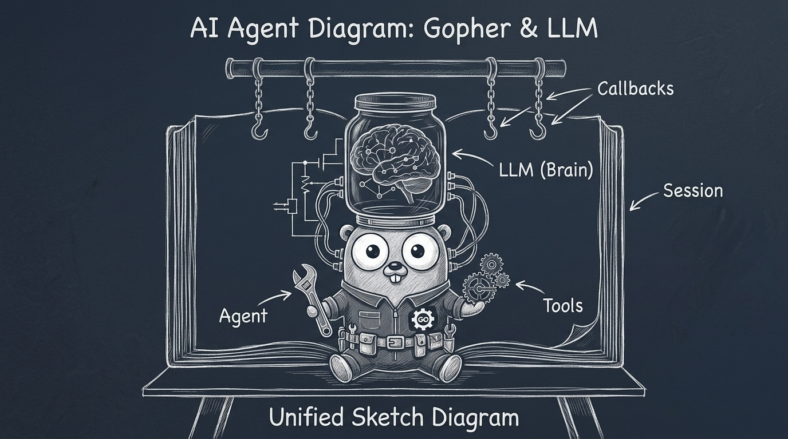
</div>

<!--
1. **Agents** — building block หลัก มี 3 ประเภท
2. **Tools** — ความสามารถเสริมที่ agent เรียกใช้ได้
3. **Sessions** — context ที่ agent ทุกตัวต้องรันอยู่ข้างใน
4. **Callbacks** — hook แทรกรอบ agent execution

ย้ำว่า 4 ข้อนี้ไม่ใช่ peer เดียวกันหมด — Agent คือตัวทำงานหลัก
ส่วน Tool/Session/Callback คือ concept ที่ agent เอาไปประกอบด้วย

Analogy เดียวจบ (พนักงาน) ใช้พูดสดตรงนี้ได้เลย:
- **Agent** = ตัวพนักงาน (the "who") — คนลงมือทำงานจริง มี 3 ประเภท (จะเจาะทีหลัง)
- **Tools** = อุปกรณ์ที่พนักงานหยิบใช้ (the "what") — เรียก API, search, run code
- **Sessions** = ห้องทำงาน/บริบทที่พนักงานต้องยืนอยู่ข้างใน (the "where") — ไม่มีห้องนี้ พนักงานทำงานไม่ได้เลย (ไม่มี session ไม่มี invocation)
- **Callbacks** = จุดที่หัวหน้าแทรกเข้ามาดู/แก้ระหว่างทำงาน (the "when/how ถูกสังเกต") — hook log/check/แก้ behavior

ถ้าโดนถามว่า low-code มี 4 concept นี้ไหม (เช็คแล้ว ก.ค. 2026) — 3 ใน 4 มี equivalent แล้วจริง ไม่ใช่จุดต่าง:
- **Agent (3 types)** — low-code มี node type map ได้ตรง: AI Agent node (= LLM Agent), branch/loop node (= Workflow Agent), code node (= Custom Agent)
- **Tools** — low-code ทำได้ดีเท่าหรือดีกว่าด้วยซ้ำ — connector/plugin marketplace ใหญ่กว่า
- **Sessions** — ไม่ใช่จุดต่าง low-code มี auto conversation memory ให้ตั้งแต่แรก (ตามที่คุยไว้ตอนสไลด์ "ADK คืออะไร?")
จุดที่ยังต่างชัดคือ **Callbacks**: Dify ยังไม่มี pre/post-execution hook เลย (จาก LLM ตัดสินใจเรียก tool ถึง tool execute จริง ไม่มี policy check คั่นกลาง — มี GitHub issue ขอ feature นี้อยู่ ธ.ค. 2025 ยัง pending) n8n มีแค่ "human approval gate" เฉพาะจุดก่อน tool execute ไม่ใช่ generic hook ครอบคลุมทุกจุดแบบ ADK (Go v2 มี 8 ชนิดใน llmagent.Config: BeforeAgent/AfterAgent, BeforeModel/AfterModel/OnModelError, BeforeTool/AfterTool/OnToolError)
สรุป: Callbacks คือจุดแข็งเฉพาะของ code-first framework ตอนนี้ ไม่ใช่ Agent/Tools/Sessions อีกต่อไป

ถ้าโดนถามว่า "ไม่มี native แล้วปลอม callback ใน low-code ได้ไหม" — ได้ แต่ทุกวิธีมี catch:
- wrap node ด้วยมือ (log ก่อน/หลังทุก tool call) — ไม่ enforce ลืมใส่ก็หลุด
- sub-workflow wrapper pattern — แค่ convention ห้ามใครแอบเรียก tool ตรงข้าม wrapper ไม่ได้
- n8n Global Error Workflow — จับได้แค่ตอน error เท่านั้น ไม่ใช่ทุกจุด
- n8n human-approval gate — scope แคบ เฉพาะ pre-tool-call
- Dify moderation API extension — ใกล้สุด แต่ต้อง host code ภายนอกเอง (หนีไปเขียนโค้ดอยู่ดี)
สรุปรวม: ทุกวิธีเป็นได้แค่ convention ไม่ enforce หรือไม่ก็ต้องเขียนโค้ดจริงนอก platform ไม่มีทาง generic hook แบบ built-in ใน UI ล้วนๆ

ปิดด้วย transition: "เดี๋ยวจะแกะ Agent (ตัวหลัก) ก่อนว่ามี 3 ประเภทอะไรบ้าง แล้วค่อยย้อนมาเจาะ Tools/Sessions/Callbacks พร้อมโค้ดจริงทีละตัว"
-->

---
layout: "split-3"
ratio: "33/34/33"
background: "#0f172a"
color: "#f8fafc"
---

# 1. Agents — 3 Types

::left::
<h3 style="text-align: center; color: #60a5fa;">LLM Agent</h3>
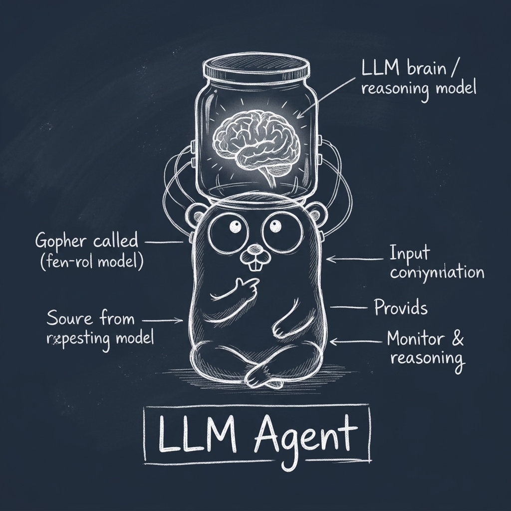

::center::
<h3 style="text-align: center; color: #a78bfa;">Workflow Agent</h3>
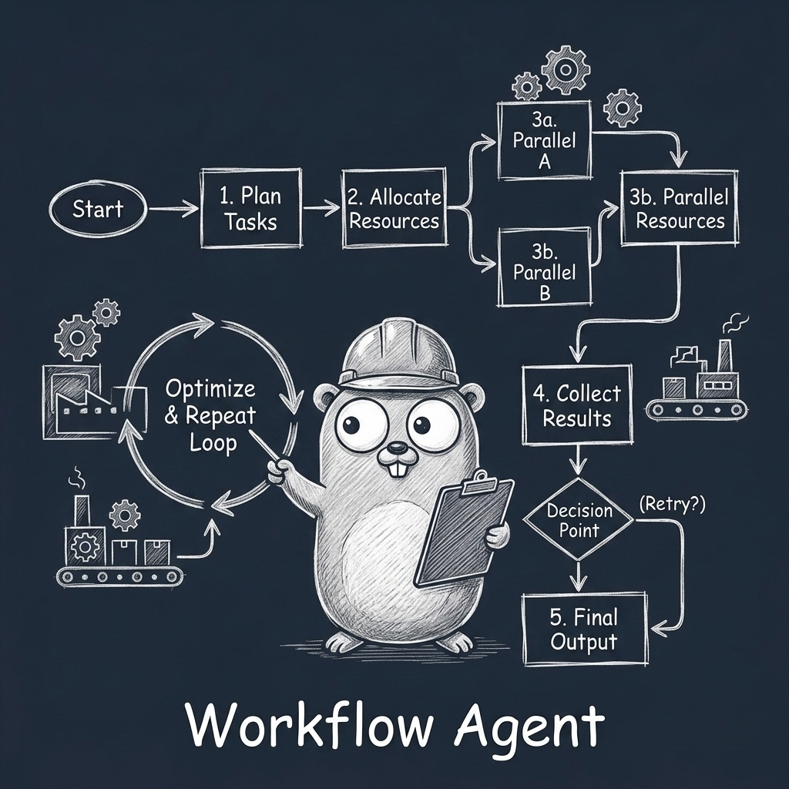

::right::
<h3 style="text-align: center; color: #f472b6;">Custom Agent</h3>
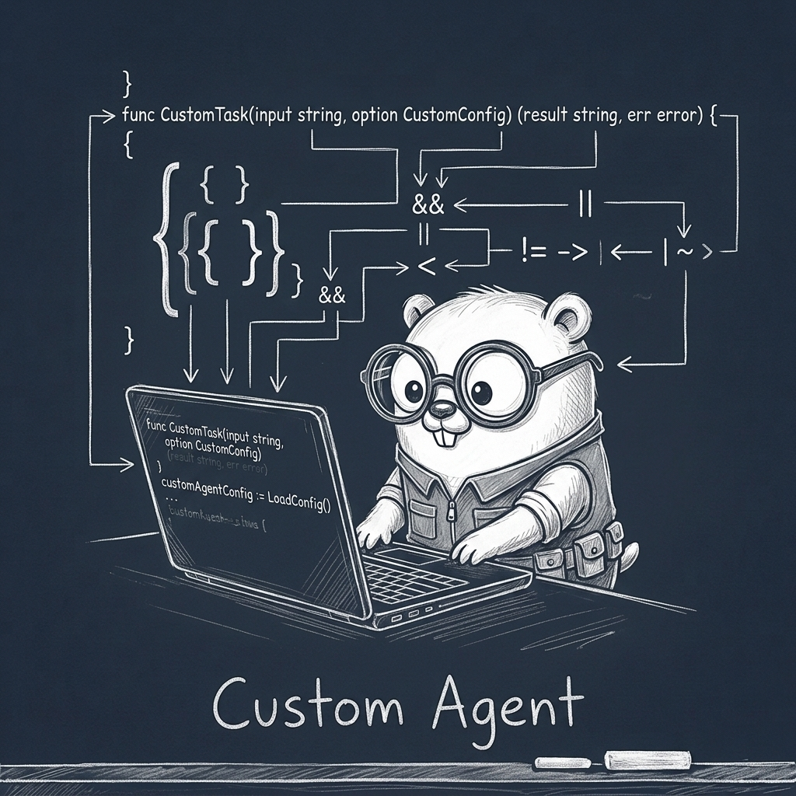

<!--
กำหนดจาก interface เดียว agent.Agent — 3 แบบคือ polymorphism บน Run() เดียวกัน
ใครเป็นคนตัดสินใจ "ขั้นต่อไปทำอะไร" ต่างกันเท่านั้น

LLM Agent (สมอง) — ใช้ LLM reason/plan/call tool เอง
Workflow Agent (ผู้จัดการ) — คุม flow แบบ sequential/parallel/loop ไม่ใช้ LLM ตัดสินใจ
Custom Agent (ผู้เชี่ยวชาญ) — logic เขียนเอง 100%

ใช้งานประเภทไหน:
- LLM Agent — งาน requirement ไม่ตายตัว ต้อง reasoning เอง เช่น ตอบคำถามปลายเปิด, วางแผนงาน, สรุปเอกสาร, เลือก tool เองตามสถานการณ์
- Workflow Agent — งานที่ flow ตายตัวอยู่แล้ว รู้ล่วงหน้าว่าต้องทำอะไรก่อนหลัง เช่น pipeline เขียนโค้ด→review→refactor (Sequential), ดึงข้อมูลจากหลาย source พร้อมกัน (Parallel), retry/polling/refine ซ้ำจนกว่าจะผ่านเงื่อนไข (Loop)
- Custom Agent — งาน deterministic ล้วนหรือ integrate ของเดิม เช่น validate/format ข้อมูล, เรียก internal API, เชื่อม legacy system เข้า agent tree

ถ้าโดนถามว่า "mechanism (reason/plan/call tool)" กับ "use case (requirement ไม่ตายตัว)" ขัดแย้งกันไหม — ไม่ขัด เป็นคนละช่วงเวลา ยกตัวอย่างชัดๆ:
user พิมพ์ "ช่วยหาเที่ยวบินไปเชียงใหม่ศุกร์นี้ ถ้าถูกกว่า 2,000 จองเลย"
1. LLM **reason**: "ต้องรู้ราคาก่อน" → **plan** เรียก tool `search_flights` ก่อน
2. ได้ราคากลับมา 1,800 → LLM **reason** ต่อ: "1,800 < 2,000 เข้าเงื่อนไข" → เรียก tool `book_flight` เอง
3. ไม่มีใครเขียน `if price < 2000 { bookFlight() }` ไว้ล่วงหน้า — LLM คิดลำดับ tool และเงื่อนไขจองเอง ตอน runtime ล้วนๆ (นี่คือ mechanism)
เพราะคิดสดแบบนี้ได้ มันเลย fit กับ use case "requirement ไม่ตายตัว" — ตอนเขียน agent ไม่รู้ล่วงหน้าว่าราคาจะเท่าไหร่ ไม่รู้จะเข้าเงื่อนไขจองไหม
contrast: ถ้าโจทย์เปลี่ยนเป็น "ค้นหาเที่ยวบิน → ส่ง email สรุปราคาทุกครั้ง ไม่ต้องตัดสินใจ" — requirement ตายตัว (fixed 2 step) ไม่คุ้มเรียก LLM มาคิด เขียน `SequentialAgent` (deterministic) พอ ประหยัด cost+latency กว่า
สรุป: บรรทัดแรกคือสิ่งที่เกิดตอน runtime (mechanism) บรรทัดสองคือสัญญาณเลือก agent type ตอนออกแบบ (use case) — คนละช่วงเวลา ไม่ใช่คนละเรื่องที่ขัดกัน

ถ้าโดนถามว่า "แบบนี้ทำได้แค่ chatbot คุยโต้ตอบกับคนใช่ไหม" หรือ "เอาไปทำ CLI/API ได้ไหม" — ไปดูตอน slide "Tools / Sessions / Callbacks" (bullet Sessions) มีตัวอย่าง cron automation + CLI/API front-end ครบ (เรื่องนี้เป็นเรื่อง Session/invocation trigger ไม่ใช่เรื่อง 3 ประเภท agent โดยตรง)

ย้ำ: Workflow Agent เองไม่มี LLM ตัดสินใจ control flow เลย (deterministic 100% ที่ตัวมันเอง)
แต่ sub-agent ที่มันเรียกใช้ยังเป็น LLM Agent ได้ปกติ — LLM ไม่ได้หายไปทั้งระบบ แค่ layer ควบคุม flow ไม่ใช้ LLM เท่านั้น
เช่น SequentialAgent สั่งรัน LLM Agent 3 ตัวเรียงกัน ตัว Sequential เองไม่คิดอะไร แค่ไล่รันตามลำดับ แต่แต่ละ step ข้างในยัง reasoning ด้วย LLM ได้เต็มที่

บอกคนฟังไว้ตรงนี้: เดี๋ยวจะเจาะทีละประเภทพร้อมโค้ดจริง เรียงตามเลข 1→2→3 เลย
-->

---
layout: "split-3"
ratio: "33/34/33"
background: "#1e293b"
color: "#f8fafc"
---

# 2 – 4. Tools / Sessions / Callbacks

::left::
<h3 style="text-align: center; color: #60a5fa;">Tools</h3>


::center::
<h3 style="text-align: center; color: #a78bfa;">Sessions</h3>
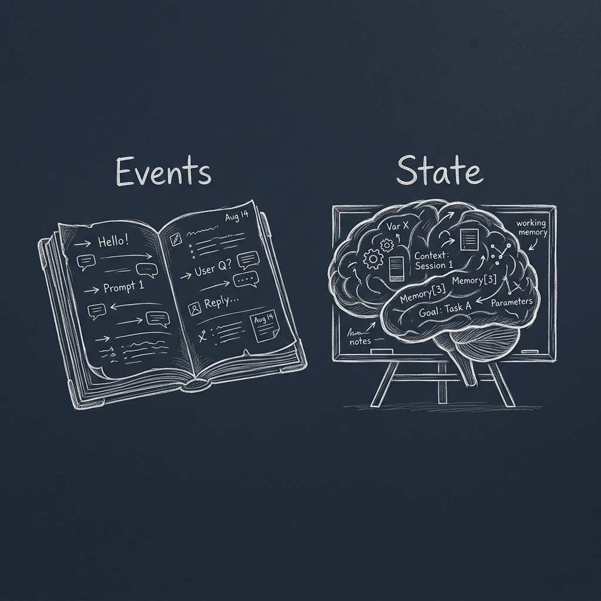

::right::
<h3 style="text-align: center; color: #f472b6;">Callbacks</h3>
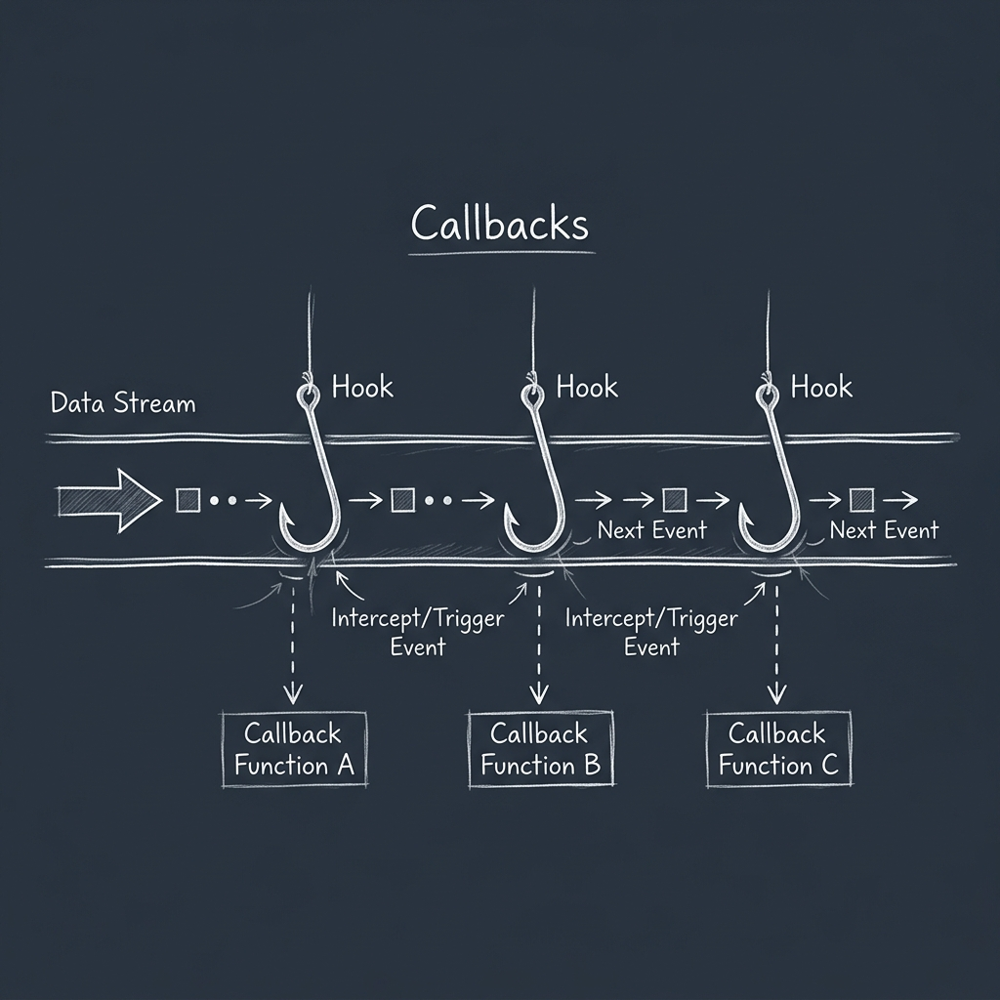

<!--
- **Tools** — ให้ agent ทำอะไรนอกเหนือคุย: เรียก API, search, run code, เรียก service อื่น
- **Sessions** — คุม context การสนทนาแต่ละครั้ง แยก 2 ส่วน: **Events** (history) กับ **State** (working memory)
- **Callbacks** — hook เข้าไปแทรกจุดต่างๆ ใน agent execution เพื่อ log/check/แก้ behavior

Session คือสภาพแวดล้อมที่ agent ทุกตัวต้องรันอยู่ข้างใน ไม่มี session ไม่มี invocation

ถ้าโดนถามว่า "Tools/Session/Callback ใช้ได้แค่กับ LLM Agent หรือเปล่า" — ไม่ใช่ ผสมกัน แยกทีละตัว:
- **Session — universal จริง ไม่ใช่ LLM-only** หลักฐานอยู่ในสไลด์นี้เอง: โค้ด Custom Agent (`runGreeting`) เรียก `session.NewEvent(ic, ...)` ตั้ง Author/Branch/LLMResponse.Content เองด้วยมือ ไม่มี LLM เลยแต่ยังต้องรันใน Session เหมือนกัน กฎ "ไม่มี session ไม่มี invocation" ใช้กับทุก agent type รวม Workflow Agent ที่ event ของ sub-agent ทุกตัวก็ไปโผล่ใน session เดียวกันหมด
- **Tools — ผูกกับ LLM Agent จริง แต่เพราะไม่จำเป็นที่อื่น ไม่ใช่ห้ามใช้** `tool.Tool` (พร้อม jsonschema) มีไว้ให้ LLM "อ่าน" แล้วเลือกเรียกเอง Custom Agent ไม่ต้องห่อเป็น Tool เลย เรียก function/API ตรงในโค้ด Go ได้ปกติเพราะไม่มี LLM ต้องมาเลือก ส่วน Workflow Agent ไม่เรียก tool เองด้วยซ้ำ (เรียก sub-agent ไม่ใช่ tool)
- **Callbacks — ครึ่งๆ กลาง** ระดับ agent (BeforeAgentCallbacks/AfterAgentCallbacks — อยู่ใน agent.Config กลาง) ใช้ได้ทั้ง 3 แบบเพราะห่อรอบ `Run()` ทั้งก้อน ไม่สนใจว่าข้างในมี LLM หรือเปล่า แต่ระดับ model/tool (BeforeModel/AfterModel/OnModelError, BeforeTool/AfterTool/OnToolError — อยู่ใน llmagent.Config) fire ได้เฉพาะใน LLM Agent's loop เท่านั้น เพราะ Workflow/Custom Agent ไม่มี model call/tool call อัตโนมัติให้ hook เข้าไปแทรก

ถ้าโดนถามว่า "แบบนี้ทำได้แค่ chatbot คุยโต้ตอบกับคนใช่ไหม" — ไม่ใช่ chat เป็นแค่หนึ่งในวิธี trigger invocation เท่านั้น ไม่ใช่ธรรมชาติบังคับของ Session
"user message" ที่เริ่ม invocation ไม่จำเป็นต้องมาจากคนพิมพ์ — เป็น text content ก้อนแรกเฉยๆ จะมาจากคนหรือ cron/webhook/event ก็ได้เหมือนกันหมด Agent ไม่รู้และไม่สนว่าใคร/อะไรส่งมา
ตัวอย่าง automation ล้วนๆ ไม่มีคนโต้ตอบเลย: cron รันตี 3 ทุกวัน ยิง prompt สังเคราะห์เอง เช่น "สรุป error log วันนี้ ถ้าเจอ pattern ผิดปกติให้สร้าง Jira ticket" — LLM reason → เรียก tool อ่าน log → ตัดสินใจเรียก tool create_jira_ticket เอง จบ ไม่มีคนอยู่หน้าจอเลยตลอด process
Human-in-the-loop เป็นแค่ตัวเลือก (RequestedInput field ที่เห็นตอน slide Architecture/Event) ไม่ใช่ข้อบังคับ — default รันจบทั้งหมดโดยไม่มีคนแทรกเลยก็ได้

เอาไปทำ CLI/API แทน chatbot ได้ไหม — ได้ mechanism เดียวกันหมด แค่เปลี่ยนว่าใครป้อน input/รับ output:
- CLI: input จาก command-line arg แทนข้อความแชท stream event ออก stdout — ตัวอย่าง examples/adk-custom-agent (`go run . console`) ในสไลด์นี้เอง ก็เป็น CLI console front-end อยู่แล้ว ไม่ใช่ chatbot (คนละประเด็นกับ "low-code ทำ CLI ไม่ได้" ตอน slide "Google ADK (Go)" — อันนั้นพูดเรื่อง distribution/artifact อันนี้พูดเรื่อง mechanism เดียวกันข้ามหลาย front-end)
- API/backend: ห่อ Agent หลัง HTTP handler รับ JSON, รัน Runner loop ฝั่ง server, ตอบกลับเป็น SSE stream หรือ JSON เดียว ไม่มี UI เลย
สรุป: Session ≠ conversation UI — ไม่ว่า invocation จะมาจาก chat/CLI/API/cron ก็ core loop เดียวกันหมด
-->

---
layout: "default"
background: "#0f172a"
color: "#f8fafc"
---

# Agent Type 1: LLM Agent (สมอง)

<div class="flex justify-center my-4">
  
</div>

<div class="text-sm text-gray-400 text-center mt-2">
  1. เราเขียนฟังก์ชัน → 2. โยนเข้า Context → 3. LLM เรียก Tool → 4. ผลลัพธ์ส่งกลับไปที่ LLM
</div>

<!--
ตัวเดียวที่ "คิดเอง" — ใช้ LLM ตัดสินใจว่าจะทำอะไรต่อ ไม่ hardcode flow, เลือกเองว่าจะเรียก tool ไหน กี่ครั้ง จบเมื่อไหร่
ประกอบด้วย: instruction, tools, callbacks, sub-agents (delegation), input/output schema
เหมาะกับ: งานที่ requirement ไม่ตายตัว ต้องการ reasoning

ตอบคำถาม วางแผนงาน สรุปข้อมูล — พวกนี้คือ use case ของ LLM Agent

รายการข้างบนตรงกับ field จริงใน llmagent.Config (verify กับ v2.0.0 แล้ว): Instruction/InstructionProvider, Tools/Toolsets, callbacks 8 ชนิด, SubAgents, InputSchema/OutputSchema, OutputKey
ระวัง: อย่าพูดถึง "planner" กับ "code execution" — สองอันนั้นเป็น feature ของ ADK **Python** ยังไม่มีใน Go v2 (grep ทั้ง package แล้วไม่มี CodeExecutor เลย) ถ้าโดนถามตอบตรงๆ ว่า Go version ยังไม่มี ต้องทำเองผ่าน tool/Custom Agent
SubAgents บน LLM Agent คือกลไก delegation — LLM ตัดสินใจ transfer งานให้ sub-agent ได้เอง (ปิดได้ด้วย DisallowTransferToParent/DisallowTransferToPeers)
-->

---

# LLM Agent — สร้าง Tool (ADK Go v2)

```go
type SearchTimeArgs struct {
	Timezone string `json:"timezone" jsonschema:"the IANA timezone name"`
}

type SearchTimeResult struct {
	Time string `json:"time"`
}

// A plain Go function exposed to the LLM as a callable tool.
func searchTime(ctx agent.Context, args SearchTimeArgs) (SearchTimeResult, error) {
	return SearchTimeResult{Time: "10:30 " + args.Timezone}, nil
}

searchTimeTool, err := functiontool.New(functiontool.Config{
	Name:        "search_time",
	Description: "Returns the current time for a given IANA timezone.",
}, searchTime)
```

<!--
ไม่มี tool.NewFunctionTool — ตัวจริงคือ functiontool.New[TArgs, TResults](cfg, handler) จาก package google.golang.org/adk/v2/tool/functiontool โดย handler รับ (agent.Context, TArgs) คืน (TResults, error) เป็น struct สองฝั่ง ไม่ใช่ (context.Context, string) แบบ primitive — schema ถูก infer จาก struct field ผ่าน json/jsonschema tag

ADK แปลง function signature เป็น tool schema ส่งให้โมเดลเอง แล้วปล่อยให้โมเดลตัดสินใจว่าจะเรียก searchTime ตอนไหน กี่ครั้ง
-->

---
layout: "default"
background: "#0f172a"
color: "#f8fafc"
---

# LLM Agent — ประกอบ Agent (ADK Go v2)

```go
geminiModel, err := gemini.NewModel(ctx, "gemini-2.5-flash", &genai.ClientConfig{})

assistant, err := llmagent.New(llmagent.Config{
	Name:        "assistant_agent",
	Model:       geminiModel, // model.LLM, ไม่ใช่ string
	Instruction: "You are a helpful assistant. Answer concisely in Thai.",
	Tools:       []tool.Tool{searchTimeTool},
})
```

- ไม่ต้องเขียน `Run()` เอง — `llmagent.New` มี LLM loop (reason → call tool → observe) ให้ครบ
- `Model` เป็น interface `model.LLM` — สร้างผ่าน `gemini.NewModel` ก่อน ไม่ใช่ส่ง string

<!--
ไม่ต้องเขียน Run() เอง — llmagent.New() สร้าง agent ที่มี LLM loop (reason → call tool → observe → repeat) ให้ครบในตัว (ต่างจาก Custom Agent ที่จะเห็นช่วงท้าย ซึ่งเราเขียน Run() เองทั้งหมด)

llmagent.Config.Model เป็น type model.LLM (interface) ไม่ใช่ string ชื่อโมเดล — ต้องสร้างผ่าน gemini.NewModel(ctx, "gemini-2.5-flash", &genai.ClientConfig{}) ก่อน ค่อยเอาผลลัพธ์มาใส่ (ClientConfig.APIKey ปล่อยว่างได้ มันอ่าน GEMINI_API_KEY/GOOGLE_API_KEY จาก env เอง)

โครง main() ของทุก example ใน talk นี้เหมือนกันหมด (agent.NewSingleLoader + full.NewLauncher) — สลับแค่ตัว agent ที่ยัดเข้าไป เพราะทุกตัว implement agent.Agent interface เดียวกัน

โค้ดเต็ม build verify จริงแล้วที่ examples/adk-llm-agent (`go build` ผ่านโดยไม่ต้องมี API key — รันจริงต้องตั้ง GEMINI_API_KEY ก่อน)
-->

---
layout: "default"
background: "#1e293b"
color: "#f8fafc"
---

# Agent Type 2: Workflow Agent (ผู้จัดการ)

ไม่ใช้ LLM ตัดสินใจ flow เลย — deterministic control ล้วน

- **SequentialAgent** — assembly line รัน sub-agent ทีละตัวตามลำดับ
- **ParallelAgent** — แจกงานพร้อมกัน รัน sub-agent concurrent
- **LoopAgent** — while loop วนจนเข้าเงื่อนไขหยุด หรือถึง max iteration

**compose กันได้:** เอา LLM Agent ไปเป็น sub-agent ใน Sequential/Parallel/Loop ได้ ผสมเป็น tree

<!--
Sequential = เขียนโค้ด reviewer/refactorer เป็น step เรียงกัน
Parallel = งาน independent ไม่ต้องรอกัน
Loop = polling, retry, refine ซ้ำ

ตัวอย่าง usage ที่มี LLM Agent แทรกจริง (ไม่ใช่ deterministic ล้วน — ตอบคำถาม "แล้วทำไมต้องเป็น AI Agent"):
- **Sequential** — onboarding พนักงานใหม่: สร้าง account (deterministic) → **LLM Agent ร่าง welcome email** personalize ตามตำแหน่ง/ทีม → เปิด IT ticket (deterministic)
- **Parallel** — health check dashboard: ยิง 5 microservices พร้อมกัน (deterministic) → **LLM Agent สรุป anomaly เป็นภาษาคน** ให้ on-call อ่าน แทน raw JSON
- **Loop** — payment polling: poll status ทุก 3 วิ (deterministic) จน fail → **LLM Agent ตัดสินใจ retry ช่องทางอื่นไหม/ร่าง message แจ้ง customer** ก่อน escalate ออกจาก loop
-->

---
layout: "default"
background: "#0f172a"
color: "#f8fafc"
---

# SequentialAgent — ทำงานยังไง?

<div class="flex justify-center my-4">
  
</div>

<div class="text-sm text-gray-400 text-center mt-2">
  1. Agent 1 ทำงาน → 2. ส่ง Event บันทึกลง Session → 3. Agent 2 อ่าน Context จาก Session → 4. ทำงานต่อ
</div>

<!--
ภาพเป็น loop animation 10 วิ วนซ้ำ 4 จังหวะ (จับจังหวะพูดตามนี้ได้เลย):
1. (0-2s) packet "Start" วิ่งจาก Session State (กล่องบนกลาง) ลงไป Agent 1 (draft_agent, สีชมพู) — Agent 1 กระพริบสว่างตอนรับ
2. (2.5-4.5s) packet "Add Draft" วิ่งกลับจาก Agent 1 ขึ้น Session — Session กระพริบตอนรับ แล้วเห็นแถบ "+ Event: Draft" (border สีชมพูตาม Agent 1) โผล่ในกล่อง Session
3. (4.5-6.5s) packet "Read Draft" วิ่งจาก Session ไป Agent 2 (review_agent, สีม่วง) — Agent 2 กระพริบตอนรับ
4. (6.5-8.5s) packet "Add Review" วิ่งกลับจาก Agent 2 ขึ้น Session — เห็นแถบ "+ Event: Review" (border สีม่วงตาม Agent 2) โผล่เพิ่ม

ประเด็นสำคัญที่ภาพนี้พยายามสื่อ (พูดได้ถ้ามีเวลา):
Agent 1 กับ Agent 2 ไม่เคยเรียกกันตรงๆ เลย ไม่มี arrow ระหว่าง Agent 1 กับ Agent 2 ในภาพ — ทุกอย่างวิ่งผ่าน Session State ตรงกลางเท่านั้น (hub-and-spoke ไม่ใช่ peer-to-peer)
Agent 1 ไม่ได้ "ส่ง draft ให้ Agent 2" ตรงๆ — มันแค่ "เขียน event ลง session" (emit) ส่วน Agent 2 ก็แค่ "อ่าน session ล่าสุด" เอาเอง ไม่รู้ด้วยซ้ำว่า event นั้นมาจาก Agent 1
สีของ event ในกล่อง Session (ชมพู/ม่วง) map ตรงกับสีของ agent ที่เขียนมัน — เป็น visual cue ว่า "ใครเขียนอะไรไว้บ้าง" สะสมเป็น log เรียงเวลา ไม่ใช่ overwrite
เชื่อมกับโค้ดหน้าเดียว (สไลด์ถัดไป): ฟังก์ชัน runDraft เรียก yield(emit(ic, "..."), nil) — นั่นคือ "Add Draft" packet ในภาพนี้เป๊ะๆ ไม่มี return value ส่งตรงไป Agent 2 เลย

ต่างจาก A2A/Task API ที่พูดถึงก่อนหน้า: A2A/Task delegation คือ "โอนงานตรงๆ" (function-call-like, มี caller/callee ชัดเจน) ส่วน Sequential (และ workflow agent ทั้งหมด) สื่อสารผ่าน "shared log" ล้วนๆ — สถาปัตยกรรมคนละแบบ แม้จะดู "ส่งต่องาน" เหมือนกันจากภายนอก
-->

---

# Workflow Agent — SequentialAgent (ADK Go v2)

```go
func runDraft(ic agent.InvocationContext) iter.Seq2[*session.Event, error] {
	return func(yield func(*session.Event, error) bool) {
		yield(emit(ic, "draft: เขียน proposal เวอร์ชันแรกแล้ว"), nil)
	}
}

// runReview is identical — only the message differs.

draftAgent, _ := agent.New(agent.Config{Name: "draft_agent", Run: runDraft})
reviewAgent, _ := agent.New(agent.Config{Name: "review_agent", Run: runReview})

// SubAgents go inside the embedded agent.Config; runs them in list order.
pipeline, err := sequentialagent.New(sequentialagent.Config{
	AgentConfig: agent.Config{
		Name:      "proposal_pipeline",
		SubAgents: []agent.Agent{draftAgent, reviewAgent},
	},
})
```

<!--
`emit(ic, ...)` บน slide เป็น helper ย่อในโปรเจกต์ (ห่อการสร้าง event: NewEvent + Author + Branch + Content) ไม่ใช่ API ของ ADK — โครงเต็มจะเห็นตอน slide "Custom Agent — โค้ดจริง" ถัดไป บอกคนฟังกันงงว่าหายไปไหน

`ic agent.InvocationContext` คืออะไรเต็มๆ (อธิบายตรงนี้ที่เดียวพอ ไม่ต้องพูดซ้ำตอน Custom Agent slide ถัดๆไปที่มี ic โผล่อีกรอบ — แค่ชี้กลับมาที่นี่) — verify จาก pkg.go.dev/google.golang.org/adk/v2/agent แล้ว เป็น interface embed context.Context ปกติของ Go บวก method เฉพาะของ ADK:
- Session() session.Session — เข้าถึง session ปัจจุบัน (ตัวที่เก็บ event ทั้งหมด ที่เห็นเป็น "Session State" ในภาพ animation ก่อนหน้า)
- Branch() string — path บอกตำแหน่งใน pipeline (รูปแบบ agent_1.agent_2.agent_3) ใช้กันตอน Parallel ที่ sub-agent ไม่ควรเห็น history ของ peer กัน (ตรงกับโน้ต "แต่ละตัวได้ Branch() ของตัวเอง" ที่พูดไว้ตอน slide ParallelAgent)
- Agent() Agent — agent เจ้าของ invocation นี้ (ตัวเองอ้างถึงตัวเอง)
- Artifacts() Artifacts / Memory() Memory — เข้าถึง artifact service และ memory search ของ session/user นี้
- InvocationID() string — id เฉพาะของการ invoke รอบนี้ (ใช้ trace/log)
- UserContent() *genai.Content — เนื้อหาที่ user ส่งมาตอนเริ่ม invocation นี้ (ข้อความต้นทางของทั้งเชน)
- IsolationScope() string — ถ้าตั้งไว้ LLM prompt history จะเห็นแค่ event ที่ scope ตรงกันเป๊ะ (ใช้ตัด noise จาก branch อื่น)
- RunConfig() *RunConfig — ค่า config runtime ตอนสั่งรัน (เช่น StreamingMode ที่เห็นตอน slide main() ท้าย talk)
- EndInvocation() / Ended() — สั่งจบ invocation ก่อนเวลา / เช็คว่าจบไปหรือยัง
- ResumedInput(interruptID) — ดึงค่าที่ user ตอบกลับตอน human-in-the-loop resume (เกี่ยวกับ HITL ที่พูดถึงตอน A2A/graph v2.0)

พูดสั้นๆ บนเวทีได้แค่: "ic คือกล่องที่ห่อทุกอย่างเกี่ยวกับ 'invocation รอบนี้' ไว้ให้ — จะเอา session ปัจจุบัน จะรู้ตัวเองอยู่ตรงไหนใน pipeline (Branch) จะดู user พิมพ์อะไรมา (UserContent) หยิบจาก ic ตัวเดียวได้หมด ไม่ต้องส่ง parameter แยกเป็นสิบตัว"

Package จริงคือ google.golang.org/adk/v2/agent/workflowagents/sequentialagent (ไม่ใช่ .../agent/sequentialagent ตรงๆ)
Config มีแค่ field เดียว: AgentConfig agent.Config — SubAgents ตั้งอยู่ข้างในนั้น ไม่ใช่ field แยกที่ระดับบนของ sequentialagent.Config
ถ้าเผลอตั้ง AgentConfig.Run เอง จะ error ทันที ("LoopAgent/SequentialAgent doesn't allow custom Run implementations") เพราะตัว sequentialagent.New เซ็ต Run ให้เองภายใน

ตัวอย่างนี้ใช้ Custom Agent (ฟังก์ชัน Go ธรรมดา) เป็น sub-agent เพื่อ demo แบบไม่ต้องพึ่ง LLM API key — แต่ SubAgents รับ agent.Agent อะไรก็ได้ ใส่ LLM Agent (llmagent.New(...)) แทนก็ compose กันได้แบบเดียวกันทันที ไม่ต้องเปลี่ยนโครง pipeline เลย
ผลลัพธ์: output ของ draftAgent (เป็น event ใน session) จะอยู่ใน context ให้ reviewAgent อ่านต่อได้ ผ่าน session state เดียวกัน ไม่ต้องส่งต่อ manual

โค้ดเต็ม build+run verify จริงแล้วที่ examples/adk-sequential-agent (`go run . console`)
-->

---
layout: "default"
background: "#1e293b"
color: "#f8fafc"
---

# ParallelAgent — ทำงานยังไง?

<div class="flex justify-center my-4">
  
</div>

<div class="text-sm text-gray-400 text-center mt-2">
  แจกงานให้ทุก sub-agent ประมวลผลพร้อมกัน เพื่อลดระยะเวลา (Concurrency)
</div>

<!--
ตัวอย่างงานแบบไหน: multi-source data fetching / research aggregation — ในภาพคือ fetchDocs / fetchTickets / fetchLogs (ตรงกับโค้ดสไลด์ถัดไปเป๊ะๆ) แต่ละตัวดึงข้อมูลจากคนละแหล่ง (เอกสาร, ticket ระบบ, log) ที่ **ไม่ต้องพึ่งผลลัพธ์ของกันและกันเลย** — เป็น pattern สำหรับงานที่ independent จริงๆ ไม่ใช่งานที่มีลำดับ/เงื่อนไขต่อกัน (นั่นคือหน้าที่ของ Sequential/Graph)

จังหวะ animation (6 วิ วนซ้ำ):
1. (0-2s) Session broadcast packet สีฟ้าออกไปพร้อมกันทั้ง 3 เส้นทาง (ไม่ใช่ทยอยส่งทีละตัวแบบ Sequential) ไปหา fetchDocs (ชมพู) / fetchTickets (ม่วง) / fetchLogs (เขียว)
2. (2.5-3.5s) ทั้ง 3 agent กระพริบสว่างพร้อมกัน = เริ่มทำงานพร้อมกันจริง ไม่ใช่ต่อคิว
3. (3.5-5.5s) แต่ละตัวส่ง "Res" กลับ Session ด้วยสีของตัวเอง — สังเกตว่า**ไม่บังคับมาถึงพร้อมกัน** เพราะแต่ละงานใช้เวลาจริงไม่เท่ากัน (ตรงกับโน้ตโค้ด: "forward event ตามลำดับที่มาถึงจริง ไม่รับประกันลำดับข้าม sub-agent")

จุดต่างจาก Sequential (สไลด์ก่อนหน้า) ที่ควรเน้น: Sequential มี 1 เส้นทางวิ่งตรง มี "ลำดับ" (Agent 1 ต้องเสร็จก่อน Agent 2 ถึงเริ่ม) — Parallel มี 3 เส้นทางแยกจาก Session พร้อมกัน แต่ละ sub-agent ได้ Branch() ของตัวเอง **มองไม่เห็นกันเลย** ไม่รู้ด้วยซ้ำว่ามี sub-agent อื่นกำลังรันอยู่ ต่างจาก Sequential ที่ Agent 2 อ่าน event ของ Agent 1 ได้จาก session เดียวกัน

ใช้เมื่อไหร่ในงานจริง: ลด latency รวมตอนต้องรวบรวมข้อมูลจากหลายแหล่งที่เป็นอิสระต่อกัน (เช่น research/aggregation), ไม่เหมาะกับงานที่ output ของตัวหนึ่งเป็น input ของอีกตัว (นั่นต้องใช้ Sequential)
-->

---
layout: "default"
background: "#0f172a"
color: "#f8fafc"
---

# LoopAgent — ทำงานยังไง?

<div class="flex justify-center my-4">
  
</div>

<div class="text-sm text-gray-400 text-center mt-2">
  ทำงานวนซ้ำๆ จนกว่าจะสั่งหยุด (Escalate) หรือจนกว่าจะถึงจำนวนรอบสูงสุด (MaxIterations)
</div>

<!--
SCRIPT (พูดตามจังหวะ animation 4 วิ วนซ้ำ — ต่างจาก Parallel ตรงที่ตรงนี้มี agent แค่ตัวเดียว ไม่ใช่หลายตัว):

"ตัวนี้มี agent เดียวชื่อ attemptAgent — สังเกตเส้นโค้งสีชมพูด้านขวาที่วนกลับเข้าตัวเอง นั่นคือหัวใจของ LoopAgent เลย มันไม่ได้ต่อไปหา agent ตัวอื่น มันวนกลับมาหาตัวเองซ้ำๆ"

[รอ 1-2 วิ ให้ packet สีฟ้า 'State' วิ่งจาก Session ลงมา]
"รอบแรก Session ส่ง state ปัจจุบันลงมาให้ attemptAgent — สมมติเป็นงาน retry เช่น เรียก external service ที่เพิ่ง fail ไป"

[agent กระพริบสว่าง]
"attemptAgent ลองทำงานรอบนี้ 1 ครั้ง"

[packet สีชมพู 'Update' วิ่งกลับขึ้น Session]
"เสร็จรอบนี้ก็เขียนผลกลับ session — ถ้ายังไม่สำเร็จ วนใหม่อีกรอบ เหมือนเดิมทุกอย่าง"

"คำถามคือ แล้ววนไปกี่รอบ หยุดยังไง — สองทาง: (1) ถึง MaxIterations ที่ตั้งไว้ล่วงหน้า เช่น 5 รอบ ก็หยุดเอง หรือ (2) ระหว่างทาง sub-agent ตัดสินใจเองว่า 'พอแล้ว' โดยการ set Escalate = true — พอ escalate ปุ๊บ ออกจาก loop ทันที ไม่ต้องรอครบ 5 รอบ"

"ตัวอย่างในโค้ดที่จะโชว์ต่อไป: attemptAgent ตั้ง MaxIterations = 5 แต่พอถึง attempt ที่ 3 มันเช็คเองแล้วสั่ง escalate เลย ไม่ต้องรอจนครบ 5 — เหมือนระบบที่ retry เรียก payment gateway ที่ fail ไปแล้ว 3 ครั้ง ก็ยอมแพ้ ไปแจ้ง human แทนที่จะดันทุรังจนครบโควตา"

ปิดท้ายเทียบกับ 2 แบบก่อนหน้า (ถ้ามีเวลา 10 วิ): Sequential = เส้นตรงไปข้างหน้า, Parallel = แตกออกหลายทางพร้อมกัน, Loop = วนกลับเข้าตัวเอง — สาม shape นี้แหละคือ "fix pattern" 3 แบบของ v1.x ที่พูดถึงตอน slide Version Timeline ก่อนจะกลายเป็น node ในกราฟได้อิสระใน v2.0
-->

---

# Workflow Agent — Parallel & Loop (ADK Go v2)

```go
// ParallelAgent — runs every sub-agent concurrently.
fetchAll, err := parallelagent.New(parallelagent.Config{
	AgentConfig: agent.Config{
		Name:      "fetch_all_sources",
		SubAgents: []agent.Agent{fetchDocs, fetchTickets, fetchLogs},
	},
})

// LoopAgent — repeats until escalate or MaxIterations.
retryLoop, err := loopagent.New(loopagent.Config{
	AgentConfig: agent.Config{
		Name:      "retry_loop",
		SubAgents: []agent.Agent{attemptAgent},
	},
	MaxIterations: 5,
})

// Inside attemptAgent: escalate exits the loop immediately.
if n >= 3 {
	event.Actions.Escalate = true
}
```

<!--
Package จริง: google.golang.org/adk/v2/agent/workflowagents/parallelagent และ .../loopagent — Config ทั้งคู่ห่อด้วย AgentConfig agent.Config เหมือน SequentialAgent ทุกอย่าง (SubAgents อยู่ข้างใน ไม่ใช่ field แยก)

ParallelAgent: fetchDocs/fetchTickets/fetchLogs เป็น agent.Agent อะไรก็ได้ (LLM Agent หรือ Custom Agent) ที่ independent กัน ไม่ต้องรอผลกันเอง — สั่งรันพร้อมกันแล้ว forward event จากทุก sub-agent กลับมาตามลำดับที่มาถึงจริง (ไม่รับประกันลำดับข้าม sub-agent) แต่ละตัวได้ Branch() ของตัวเอง ไม่เห็น history กัน
ใช้เมื่องานแยกกันได้จริง เช่น ดึงข้อมูลจากหลาย source พร้อมกันเพื่อลด latency รวม

LoopAgent: SubAgents รันเรียงกันในแต่ละรอบ (เหมือน mini-Sequential) แล้ววนซ้ำทั้ง block นั้นใหม่
หยุดด้วย 2 เงื่อนไข: (1) sub-agent ตัวใดตัวหนึ่ง set event.Actions.Escalate = true ระหว่างรอบ — ออกจาก loop ทันที ไม่ต้องรอครบ MaxIterations หรือ (2) ถึง MaxIterations (ถ้าตั้งเป็น 0 คือวนไม่จำกัดจนกว่าจะ escalate)
ใช้เมื่อ: retry จนกว่าจะสำเร็จ, polling รอผลจาก external service, refine คำตอบซ้ำจนกว่า quality check จะผ่าน

ทั้งสองแบบยังเป็น layer ที่ไม่มี LLM ตัดสินใจ — sub-agent ข้างในจะเป็น LLM Agent ก็ได้ตามปกติ (compose กันได้เหมือนที่ย้ำไว้ตอน slide 3 ประเภท agent)

โค้ดเต็ม build+run verify จริงแล้วที่ examples/adk-parallel-agent และ examples/adk-loop-agent (ตัวหลัง escalate จริงที่ attempt #3 ก่อนถึง MaxIterations=5 ตาม log)
-->

---
layout: "default"
background: "#0f172a"
color: "#f8fafc"
---

## Agent Type 3: Custom Agent

<div class="flex justify-center my-4">
  
</div>

<div class="text-sm text-gray-400 text-center mt-2">
  เราเขียน Go function ธรรมดา และสั่ง `yield(event)` เพื่อส่งค่า Event ให้ ADK Runner ทีละตัว
</div>

<!--
สร้างผ่าน agent.New(agent.Config{Run: ...}) — เขียน Run() logic เองเต็มที่ ไม่ผูก pattern สำเร็จรูป (ไม่มี BaseAgent struct ให้ embed)
ใช้เมื่อ: ต้องการ deterministic step ผสมกับ LLM step (validate/format/call internal API), ประหยัด cost+latency (ไม่ต้อง call LLM ทุก step), integrate ระบบ legacy เข้า agent tree เดียวกัน, custom control flow ที่ Sequential/Parallel/Loop ไม่พอ

Custom Agent คือช่องให้ "หลุดจาก LLM" ตรงไหนก็ได้ในระบบ agent
ในสถานการณ์จริงมักไม่ยืนเดี่ยว แต่เป็น sub-agent แทรกอยู่ใน pipeline ที่มี LlmAgent ล้อมอยู่
interface agent.Agent มี unexported method บังคับ — implement ตรงๆ ไม่ได้ ต้องผ่าน agent.New เท่านั้น

ถ้าโดนถามว่า "ADK ต้องเป็น AI Agent เสมอไปไหม" — ไม่ต้อง Custom Agent คือหลักฐานชัดสุด: "logic เขียนเอง 100%" ไม่ได้บังคับว่าต้องมี LLM หรือแม้แต่ AI เลยก็ได้
ตัวอย่าง: `risk_scoring_agent` เรียก traditional ML model (scikit-learn/TensorFlow classifier ที่ train ไว้ก่อนแล้ว ไม่ใช่ LLM) มาให้คะแนน fraud risk ของ transaction แล้วส่งผลต่อใน pipeline — ไม่มี LLM แม้แต่นิดเดียวในจุดนี้
สรุปภาพรวม (แยกให้ชัดว่าส่วนไหน generic ส่วนไหนผูก LLM):
- generic ล้วน (ไม่ผูก LLM เลย): agent.Agent interface, Runner event loop, Session (Events+State), Workflow Agent (Sequential/Parallel/Loop), Custom Agent
- ผูกกับ LLM จริง: เฉพาะ LLM Agent type (wrap model.LLM), instructions/planner, tool schema generation
พูดง่ายๆ: เรียก ADK ว่า "AI Agent framework" เพราะ use case ส่วนใหญ่มี LLM Agent อยู่ใน tree แต่ตัว infrastructure เองเป็น general multi-agent orchestration (เทียบ Temporal/Akka ตามที่พูดไว้ตอน slide Architecture) ไม่ได้บังคับว่าทุก node ต้องมี AI/LLM
-->

---

# Custom Agent — โค้ดจริง (ADK Go v2)

```go
func runGreeting(ic agent.InvocationContext) iter.Seq2[*session.Event, error] {
	steps := []string{
		"เริ่มทำงาน...",
		"กำลังประมวลผล...",
		"เสร็จแล้ว: สวัสดี จาก custom agent ล้วนๆ ไม่มี LLM",
	}
	return func(yield func(*session.Event, error) bool) {
		for _, text := range steps {
			event := session.NewEvent(ic, ic.InvocationID())
			event.Author = ic.Agent().Name()
			event.Branch = ic.Branch()
			event.LLMResponse = model.LLMResponse{
				Content: genai.NewContentFromText(text, genai.RoleModel),
			}
			if !yield(event, nil) {
				return // caller (Runner) ขอหยุดกลางทาง
			}
		}
	}
}
```

<!--
โค้ดนี้ build + run จริง ผ่าน `go run . console` ยืนยันแล้วว่าทำงานถูกต้อง
ดูเต็มที่ examples/adk-custom-agent ที่ github.com/pallat/adk/tree/main/examples
ไม่มี agent.BaseAgent struct ให้ embed — ต้องสร้างผ่าน agent.New เท่านั้น
(interface agent.Agent มี unexported method บังคับ ห้าม implement ตรงๆ)

`ic` ตรงนี้ตัวเดียวกับที่อธิบายเต็มไปแล้วตอน slide "Workflow Agent — SequentialAgent" (Session/Branch/Agent/UserContent/ฯลฯ) ไม่ต้องพูดซ้ำ — ตรงนี้แค่ชี้ให้เห็นว่า `ic.InvocationID()`, `ic.Agent().Name()`, `ic.Branch()` ที่ใช้จริงในโค้ดบรรทัด 735-737 คือ method ตัวเดียวกันที่คุยไปแล้วนั่นแหละ ไม่ใช่ของใหม่

slide ถัดไปสรุปจุดสังเกต 3 ประเภท แล้วอีกสไลด์ถัดไปจากนั้นจะเจาะว่า runGreeting ตัวนี้แหละ ทำงานกับ Runner ยังไง (ask-yield)
-->

---
layout: "default"
background: "#1e293b"
color: "#f8fafc"
---

# 3 Types — สังเกตจากโค้ดยังไง

<div style="display: flex; flex-direction: row; gap: 1rem; align-items: flex-start; justify-content: space-between; transform: scale(0.9); transform-origin: top center; margin-top: 1rem;">

<!-- 1. LLM Agent -->
<div style="flex: 1; min-width: 0;">
<h3 style="text-align: center; color: #60a5fa; margin-bottom: 0.5rem; font-size: 1.1rem; line-height: 1;">LLM Agent</h3>
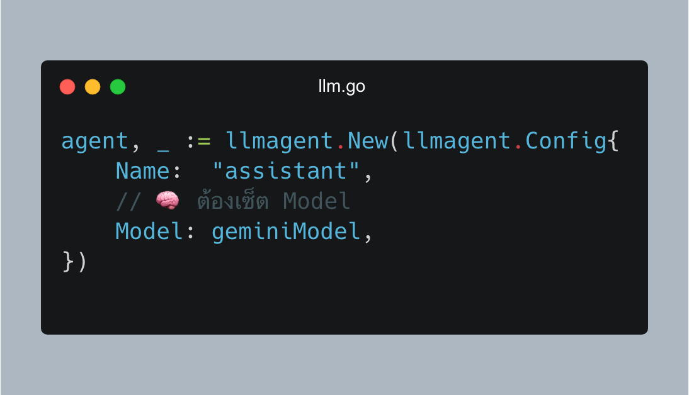
<div style="font-size: 0.75rem; text-align: center; color: #9ca3af; margin-top: 0.5rem; line-height: 1.2;">
  ADK คุม flow ให้<br/>(reason→plan→tool loop)
</div>
</div>

<!-- 2. Workflow Agent -->
<div style="flex: 1; min-width: 0;">
<h3 style="text-align: center; color: #c084fc; margin-bottom: 0.5rem; font-size: 1.1rem; line-height: 1;">Workflow Agent</h3>
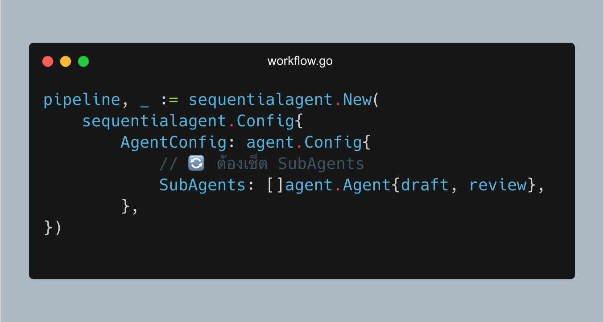
<div style="font-size: 0.75rem; text-align: center; color: #9ca3af; margin-top: 0.5rem; line-height: 1.2;">
  ADK คุม flow ให้<br/>(deterministic, แก้ไม่ได้)
</div>
</div>

<!-- 3. Custom Agent -->
<div style="flex: 1; min-width: 0;">
<h3 style="text-align: center; color: #f472b6; margin-bottom: 0.5rem; font-size: 1.1rem; line-height: 1;">Custom Agent</h3>
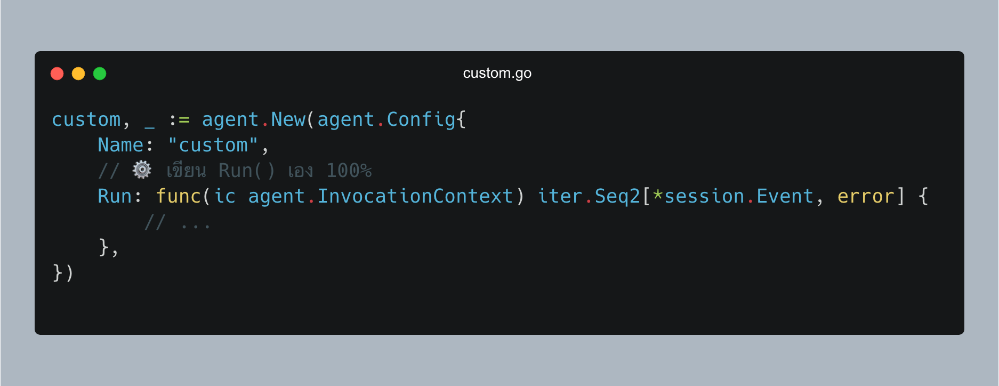
<div style="font-size: 0.75rem; text-align: center; color: #9ca3af; margin-top: 0.5rem; line-height: 1.2;">
  คุณเขียน flow เองทั้งหมด
</div>
</div>

</div>

<!--
สไลด์สรุปปิด arc "3 Types" — คนดูเพิ่งเห็นโค้ดครบทั้ง 3 ตัวอย่างมาแล้ว (llmagent.Config ตอน LLM Agent, sequentialagent.Config ตอน Workflow Agent, agent.Config{Run: runGreeting} ตอน Custom Agent) จุดนี้แค่ recap ให้จำง่าย ไม่ต้องอธิบายซ้ำลึก พูดสั้นๆ ~1 นาทีพอ

verify แล้วจาก source จริง (google.golang.org/adk/v2@v2.0.0): agent.New ไม่ validate cfg.Run เลย (รับตรงๆ) ส่วน sequentialagent.New/parallelagent.New/loopagent.New เช็ค "if cfg.AgentConfig.Run != nil { return error }" แล้วยัด Run ของตัวเองทับเสมอ — นี่คือหลักฐานเดียวกับที่คุยไว้ตอน slide "3. Custom Agent" เรื่อง deterministic แบบบังคับ vs แบบธรรมเนียม
-->

---
layout: "default"
background: "#0f172a"
color: "#f8fafc"
---

# Event Flow: ask-yield pattern

<div class="flex justify-center my-4">
  
</div>

<!--
runGreeting ตัวเดียวกับ slide ที่แล้วเป๊ะ — ดู flow ว่า Runner คุยกับมันยังไง
จุดสำคัญ: Run() ถูกเรียก "ครั้งเดียว" โดย Runner ไม่มีการเรียกซ้ำแบบ Next()
ตัว runGreeting เองต้องมี loop ข้างในถ้าอยากส่งหลาย event — ไม่มี magic จาก runtime
yield คืน false = caller ขอหยุดกลางทาง (context cancel) ต้อง return ทันที
-->

---
layout: "two-cols"
background: "#1e293b"
color: "#f8fafc"
---

# ทำไม Run ต้องคืน `iter.Seq2`

## ปัญหาที่ต้องแก้
1. Agent ตัวเดียวอาจส่งได้หลาย event
2. ต้อง lazy/streaming ไม่รอครบก่อนส่ง
3. หยุดกลางทางได้ทันที ไม่มี goroutine leak

## ทำไมไม่ใช้ slice/channel
- `[]*Event` ต้องรันจบก่อนถึง return ได้ — ขัด streaming
- `chan *Event` ต้อง spawn goroutine ทุกชั้นของ agent tree — sync ยุ่ง เสี่ยง leak
- `iter.Seq2` เป็น **pull-based** — รันบน stack เดียวกัน ไม่ต้อง goroutine เลย

<!--
yield return false ส่งสัญญาณหยุดตรงไปถึงบรรทัดถัดไปทันที ไม่ต้องเช็ค ctx.Done() กระจายทั่วโค้ด
-->

---
layout: "default"
background: "#0f172a"
color: "#f8fafc"
---

# `iter.Seq2` ทำงานยังไง (compiler desugar)

```go
// type จริงใน std lib "iter" (Go 1.23+)
type Seq2[K, V any] func(yield func(K, V) bool)

// สิ่งที่เราเขียน (สไลด์ก่อนหน้า):
for event, err := range runGreeting(ic) {
    fmt.Println(event)
    if err != nil { break }
}

// สิ่งที่ compiler แปลงให้จริงๆ — แค่ฟังก์ชันเรียกฟังก์ชัน ไม่มี magic:
runGreeting(ic)(func(event *session.Event, err error) bool {
    fmt.Println(event)
    if err != nil { return false } // break → return false แทน
    return true                     // จบ body ปกติ → return true (ทำต่อ)
})
```

**`range` บน func value ไม่ได้รันขนาน — เป็นแค่ nested function call บน stack เดียวกัน**

<!--
นี่คือสไลด์ที่ตอบคำถามค้างจาก 2 สไลด์ก่อนหน้า (ask-yield animation + "ทำไม Run ต้องคืน iter.Seq2") ว่า "pull-based ไม่ต้อง goroutine" มันทำงานยังไงจริงๆ ในระดับภาษา

จุดที่ต้องเน้น: `for k, v := range fn` เมื่อ fn เป็น func type (ไม่ใช่ slice/map/chan) คือ syntax พิเศษของ Go 1.23+ (range-over-func) — compiler แปลง loop body ทั้งก้อนให้กลายเป็น closure ตัวหนึ่ง แล้วส่ง closure นั้นเข้าไปเป็น argument ชื่อ yield ให้ fn เรียกเอง

เดินตาม stack จริงตอน runtime (พูดทีละขั้นได้):
1. Runner เรียก runGreeting(ic) → ได้ func กลับมา (ยังไม่รันอะไรข้างในเลย แค่ได้ closure)
2. Runner เอา func นั้นมาเรียกอีกที พร้อมส่ง yield closure (ที่ compiler สร้างจาก loop body) เข้าไป — ตรงนี้แหละที่ runGreeting เริ่มทำงานจริง
3. ข้างใน runGreeting วน loop เอง (for _, text := range steps) แล้วเรียก yield(event, nil) — การเรียก yield คือการเรียก "loop body ของ Runner" ตรงๆ เหมือนเรียกฟังก์ชันธรรมดา ไม่ใช่ IPC ไม่ใช่ channel
4. yield รันจบ (loop body ของ Runner ทำงานเสร็จ 1 รอบ) แล้ว return true กลับมาที่ runGreeting — runGreeting ทำงานต่อ loop รอบถัดไป
5. วนแบบนี้ไปเรื่อยๆ จนกว่า steps หมด (จบเอง) หรือ yield return false (Runner สั่ง break/return กลางทาง)

ตรงนี้เป็นจุดตอบว่าทำไมสไลด์ก่อนหน้าพูดว่า "รันบน stack เดียวกัน ไม่ต้อง goroutine เลย" ได้จริง — เพราะมันคือ function call ปกติ 2 ฝั่งสลับกันเรียกกันไปมา (Runner เรียก runGreeting เรียก yield ซึ่งก็คือ Runner's loop body อีกที) ไม่มี concurrency เข้ามาเกี่ยวเลยตลอด flow นี้

ถ้ามีเวลา เชื่อมกับ animation สไลด์ ask-yield ที่เพิ่งดูไป: packet "yield event" ที่วิ่งจาก runGreeting กลับไป Runner ในภาพ คือ call เข้า yield closure นี่เอง ส่วน packet "return true" ที่วิ่งกลับ คือค่าที่ yield return หลัง loop body ของ Runner ทำงานเสร็จ
-->

---
layout: "default"
background: "#0f172a"
color: "#f8fafc"
---

# `iter.Seq2` Execution Flow

<div class="flex justify-center my-4">
  
</div>

<!--
นี่คือการทำงานระดับ Runtime ของ compiler desugar ในสไลด์ที่แล้ว:

1. **ทำงานบน Stack เดียวกัน (No Concurrency):** 
   - แอนิเมชันจะวิ่งสลับไปมาระหว่างฝั่งซ้าย (Iterator) และฝั่งขวา (Yield Callback) โดยไม่มีการสร้าง Goroutine หรือเปิด Channel เลย เป็นแค่การเรียกฟังก์ชันซ้อนฟังก์ชันธรรมดา

2. **จังหวะที่ 1 (Call Callback):**
   - เมื่อฝั่งซ้าย (`runGreeting`) วนลูปสร้าง event เสร็จ มันจะเรียก `yield(event, nil)` 
   - ค่าควบคุมจะกระโดดข้ามสะพานเชื่อม (เส้นสีฟ้า) ไปยังฝั่งขวา เพื่อรันโค้ดฝั่ง Callback (Loop Body ของฝั่งเรียก)

3. **จังหวะที่ 2 (Return True):**
   - เมื่อฝั่งขวาประมวลผลโค้ดเสร็จเรียบร้อย (เช่น สั่ง print ออกมา) มันจะส่งค่า `return true` กลับไป
   - ค่าควบคุมจะไหลย้อนข้ามสะพาน (เส้นสีม่วง) กลับมาฝั่งซ้าย เพื่อสั่งให้ฝั่งซ้ายทำรอบถัดไป

ถ้าหากฝั่งขวาพบ error และส่ง `return false` กลับไป ฝั่งซ้ายจะเจอ `if !yield(...)` เป็นจริง แล้วทำคำสั่ง `return` เพื่อปิดฟังก์ชันและจบการทำงานทั้งหมดทันทีโดยไม่มี Goroutine Leak
-->

---
layout: "default"
background: "#0f172a"
color: "#f8fafc"
---

## LLM Agent — Flow.Run() ทำงานยังไง?

<div class="flex justify-center h-[380px] w-full">
  
</div>

<!--
จุดเด่นคือเมื่อเรียก Flow.Run() ตัว Runner จะเข้าสู่ลูปการทำงานกับ LLM Agent:
1. Runner ส่ง Invocation Context (ic) บัญชีประวัติและตัวแปรของ Session
2. Agent นำข้อมูลแปลงเป็น Prompt ส่งต่อให้ LLM Model (Gemini/Claude)
3. LLM วิเคราะห์หากต้องการข้อมูลเสริม จะส่งสัญญาณสั่ง Tool Call ออกมา
4. Agent รันฟังก์ชันเครื่องมือ (Tools) ในโค้ด Go ตัวเองทันที
5. นำผลลัพธ์ (Tool Result) แปะใส่ Session context ย้อนกลับไปให้ LLM คิดต่อ
6. ทำซ้ำจนกว่า LLM จะพอใจ และส่งผลลัพธ์สุดท้ายกลับออกไปที่ Runner
-->

---
layout: "default"
background: "#0f172a"
color: "#f8fafc"
---

# Architecture

<div class="flex justify-center mt-0 mb-4">
  
</div>

<!--
จากภาพแอนิเมชัน นี่คือ 3 แกนหลักที่เป็น Built-in Infrastructure ของ ADK (อยู่ตรงกลางภาพ) ซึ่งเป็นสิ่งที่ ADK เตรียมไว้ให้เราใช้งานได้ฟรีๆ โดยไม่ต้องเขียนระบบพวกนี้เองเลยครับ:

1. มุมซ้ายบน: **Event-driven runtime** 
   - ภาพจะแสดงถึงวงล้อ Event loop (ask-yield) ที่หมุนอยู่ตลอดเวลาและส่ง Event เข้ามาที่ระบบ ADK สามารถรองรับการทำ Interruption, Cancellation หรือการรอ Human-in-the-loop ได้อย่างเป็นธรรมชาติโดยไม่บล็อก Thread หลัก

2. มุมขวาบน: **MCP Native** 
   - สังเกตที่เส้นทางนี้ จะมีแพ็กเกจข้อมูล `RPC` (สีเขียว) ส่งออกไป และ `Res` (สีน้ำเงิน) วิ่งกลับมา นี่คือ RPC layer ที่พร้อมต่อกับ External Tools/Context ตามโปรโตคอลมาตรฐาน MCP ได้ทันที (ลองนึกภาพคล้ายๆ gRPC แต่ทำมาเพื่อเชื่อม Agent กับโลกภายนอก)

3. ด้านล่าง: **Multi-agent Native** 
   - ภาพจะแสดงการยิงสัญญาณคำสั่ง `Call` กระจายลงไปยัง Sub-Agents ในรูปแบบโครงสร้างต้นไม้ (Hierarchical Tree) แสดงให้เห็นว่า ADK มีกลไก Delegate หรืองานส่งต่อให้ Agent ลูกๆ ในตัว โดยที่เราไม่ต้องมานั่งเขียนตัว Orchestrator, Router หรือ State Manager เองเลย

สรุป: 3 สิ่งนี้ไม่ใช่ปลั๊กอินที่เราต้องหามาประกอบเข้าด้วยกันเอง แต่มันคือ Infrastructure แกนกลางที่ ADK จัดเตรียมไว้ให้พร้อมใช้ งานของเราในฐานะนักพัฒนาจึงเหลือแค่การโฟกัสไปที่ Business Logic (Instructions, Tools, Flow) ของตัว Agent เท่านั้นครับ
-->

---
layout: "default"
background: "#1e293b"
color: "#f8fafc"
---

# Event

<div class="flex justify-center my-4">
  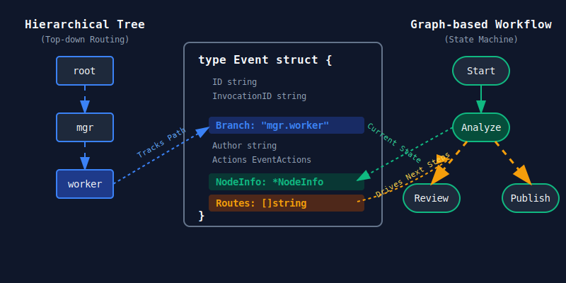
</div>

<!--
Event คืออะไร?
Event เป็น "หน่วยข้อมูลอะตอม" (Atomic Data Unit) ของทุกกระบวนการและสิ่งที่เกิดขึ้นใน ADK (ไม่ใช่แค่ข้อความแชท)

จากภาพแอนิเมชัน จะเห็นความเชื่อมโยงว่าโครงสร้างของ Event ถูกออกแบบมาให้รองรับการจัดการ Flow ได้ทั้ง 2 สถาปัตยกรรมหลักพร้อมๆ กัน:

1. ฝั่งซ้าย (Hierarchical Tree): รองรับโครงสร้างสายบังคับบัญชา (Top-down Routing)
   - Field `Branch` ทำหน้าที่เก็บรอยเท้า (Tracks Path) ว่า Event นี้ถูกสร้างมาจากจุดไหนของต้นไม้ (เช่น "mgr.worker")

2. ฝั่งขวา (Graph-based Workflow): รองรับโครงสร้างแบบ State Machine
   - Field `NodeInfo` ทำหน้าที่ระบุตัวตนและข้อมูลของโหนดที่กำลังทำงานอยู่ (Current State)
   - Field `Routes` ทำหน้าที่กำหนดทิศทางขาออก (Drives Next Steps) ว่ากราฟจะเดินไปทำงานที่ไหนต่อ (เช่น ออกไป Review หรือ Publish)

การออกแบบโครงสร้างนี้ ทำให้ ADK สามารถใช้ Event เพียงตัวเดียว เป็นตัวขับเคลื่อนได้ทั้ง Agent Tree และ Graph Workflow อย่างสมบูรณ์และไร้รอยต่อครับ
-->

---
layout: "default"
background: "#0f172a"
color: "#f8fafc"
---

# Version Timeline (ไฮไลต์)

| Version | วันออก | จุดเด่น |
|---|---|---|
| v0.4.0 | 2026-01-30 | plugin system, HITL, MCP session reconnect |
| v0.5.0 | 2026-02-20 | plugin เต็มรูป, **OTel tracing + semconv** |
| **v1.0.0** | 2026-03-20 | **GA แรก** — SSE streaming, unify context |
| v1.3.0 | 2026-05-20 | bidirectional streaming, session resumption |
| v1.5.0 | 2026-06-30 | StrictContextMock, AgentSpace compat |
| **v2.0.0** | 2026-06-30 | **breaking** — `/v2`, **graph-based workflow** |

<!--
v1.5.0 กับ v2.0.0 ออกวันเดียวกัน — ตัด branch stable คู่กับเปิดตัว v2 พร้อมกัน
-->

---
layout: "split-h"
ratio: "35/65"
background: "#1e293b"
color: "#f8fafc"
---

# จุดเปลี่ยนสำคัญ 3 จุด

::left::
<div style="font-size: 0.65em; line-height: 1.4;">

1. **v0.4–v0.5** — วาง foundation plugin + observability (OTel) ตั้งแต่ก่อน GA
2. **v1.0.0** — GA production-ready ตัวแรก
3. **v2.0.0** — เปลี่ยน paradigm จาก "Sequential/Parallel/Loop แบบ fix pattern" ไปเป็น **graph-based workflow** เขียน conditional routing เองได้

</div>

::right::
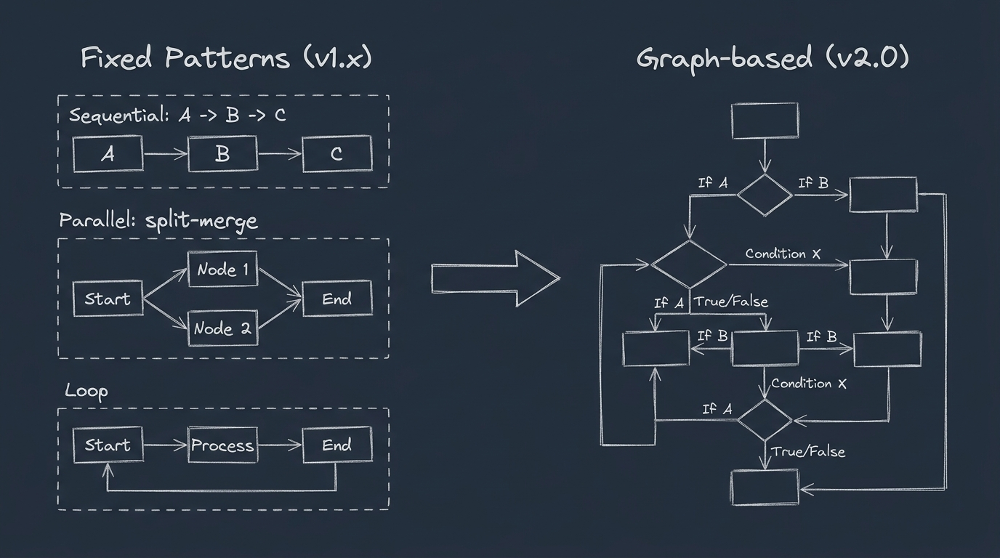

<!--
v2.0 คือตัวที่ code example ทั้งหมดใน talk นี้ใช้ไปแล้ว (google.golang.org/adk/v2)

GA = General Availability คือสถานะที่ framework พร้อมใช้งาน production จริง ไม่ใช่แค่ preview/beta/alpha แล้ว
ก่อน GA (v0.x) — API ยังเปลี่ยนได้ตลอด ไม่มี backward compatibility guarantee เหมาะกับทดลอง ไม่เหมาะ production
พอถึง v1.0.0 GA — ผู้ผลิต (Google) ยืนยันว่า API เสถียรพอจะ commit semantic versioning จริง breaking change จะไม่เกิดใน v1.x อีก (ถ้าจะ break ต้องขึ้น v2 เท่านั้น) และพร้อมรับ support/SLA ระดับ production
พูดง่ายๆ: GA คือเส้นแบ่งระหว่าง "ลองเล่นได้" กับ "เอาไปตัดสินใจ ship จริงได้"

เรื่องราว 3 จุดนี้คือ arc การเติบโตของ ADK:
1. v0.4–v0.5: ช่วงวาง foundation ก่อน GA — ใส่ของที่จำเป็นสำหรับ production (plugin, observability) ตั้งแต่ยังไม่ GA เพราะรู้ว่าต้องมีก่อนปล่อยจริง
2. v1.0.0: ผ่านจุด GA แปลว่า Google เริ่มรับประกัน API stability ทีมที่จะเอาไปใช้จริงเริ่มไว้ใจได้
3. v2.0.0: breaking change ระดับ paradigm (Sequential/Parallel/Loop แบบตายตัว → graph-based workflow เขียน routing เอง) — เกิดขึ้นได้เพราะขึ้น major version ใหม่ ไม่ผิดสัญญา semver ที่ให้ไว้ตอน v1.0.0
-->

---
layout: "split-h"
ratio: "50/50"
background: "#0f172a"
color: "#f8fafc"
---

## Graph-based Workflow (v2.0)

::left::
- **Node** = agent
- **Edge** = เส้นทางไปต่อ พร้อม condition
- **Routing** เขียนเองได้ ไม่ผูก fix pattern

::right::
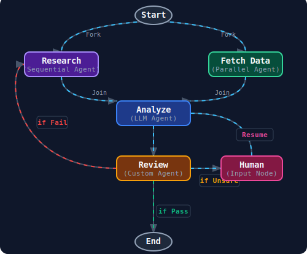

<!--
v1.x — Sequential/Parallel/Loop คือ "fix pattern" สำเร็จรูป 3 แบบ เลือกได้แค่ตายตัวตามชื่อ (เรียงลำดับ / รันพร้อมกัน / วนซ้ำ) ต่อ agent เป็น "list" หรือ "tree" ธรรมดา ไม่มี conditional branching ในตัว framework — ถ้าจะ branch ตามผลลัพธ์ต้องหลบไปเขียน Custom Agent เอาเอง

v2.0 — เปลี่ยนมาให้ประกอบ agent เป็น graph คือ node = agent, edge = เส้นทางที่ไปต่อได้ พร้อม condition กำกับแต่ละ edge เอง
เขียนเองได้ว่า "จบ node A แล้วถ้าผลลัพธ์เป็น X ไป node B, ถ้าเป็น Y ไป node C, หรือย้อนกลับไป node ก่อนหน้าก็ได้ (loop ในกราฟ)" — ไม่ต้องผูกกับ 3 pattern สำเร็จรูปอีกต่อไป

ตรงกับ `Routes`/`NodeInfo` ใน Event structure ที่เห็นไปเมื่อกี้ตอน slide Event — นั่นคือ control signal ที่บอกตำแหน่งและเส้นทางใน graph ตอน runtime

เทียบง่ายๆ: v1.x เหมือนเลือก template สำเร็จรูป (flowchart 3 แบบตายตัว), v2.0 เหมือนวาด flowchart เองได้อิสระ — เหมาะกับ agent ที่ flow ซับซ้อนและมี branching ตามผลจริง เช่น "ถ้า tool call fail ให้ retry ไป node เดิม, ถ้า confidence ต่ำให้ escalate ไป human review node"

Mix agent types ในกราฟเดียวกันได้ เพราะทุก node ก็คือ agent.Agent interface เดียวกันหมด (ตาม polymorphism ที่พูดถึงตอน slide "Agents — 3 Types")
เช่น node หนึ่งเป็น LLM Agent (คิดเอง), อีก node เป็น SequentialAgent (sub-pipeline ย่อยเรียงลำดับ), อีก node เป็น LoopAgent (วนซ้ำในตัวเอง), อีก node เป็น Custom Agent (deterministic ล้วน) — ต่อกันเป็นกราฟเดียวได้หมด
พูดอีกแบบ: v1.x pattern (Sequential/Parallel/Loop) ไม่ได้หายไปใน v2.0 แค่กลายเป็น "building block" ที่ฝังเป็น node ย่อยในกราฟใหญ่ได้ ไม่ต้องเลือกแค่ 1 pattern ครอบทั้งระบบเหมือนก่อน
-->

---
layout: "cover"
background: "linear-gradient(135deg, #1e3a8a 0%, #0f172a 100%)"
color: "#ffffff"
---

# ลองเล่นเองได้

```
go get google.golang.org/adk/v2
```

ตัวอย่างจริงทั้งหมด: `github.com/pallat/adk/tree/main/examples`
`examples/adk-custom-agent` — build ผ่าน, run ผ่านจริง กับ `google.golang.org/adk/v2`

Q&A 🐹

<!--
เปิด https://github.com/pallat/adk/tree/main/examples โชว์ live demo: go run . console แล้วพิมพ์อะไรก็ได้ ดู 3 event ยิงออกมา

เริ่มโปรเจกต์ตัวเอง: go get google.golang.org/adk/v2 แล้วดูโครง main() จาก examples ได้เลย — ทุกตัวใช้โครงเดียวกัน (agent.NewSingleLoader + full.NewLauncher จาก cmd/launcher) สลับแค่ agent ที่ยัดเข้าไป
รันแบบ LLM จริงต้องตั้ง GEMINI_API_KEY ก่อน (adk-llm-agent) ส่วน adk-custom-agent รันได้เลยไม่ต้องมี key — เหมาะเป็นตัวแรกให้คนลอง
-->
