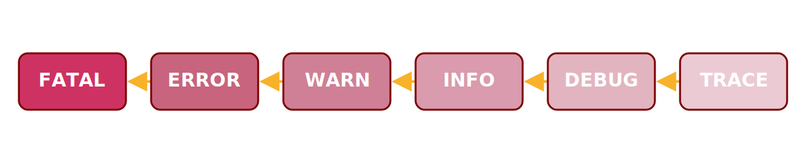
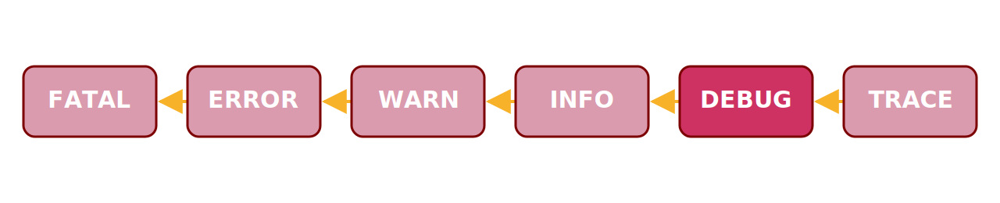
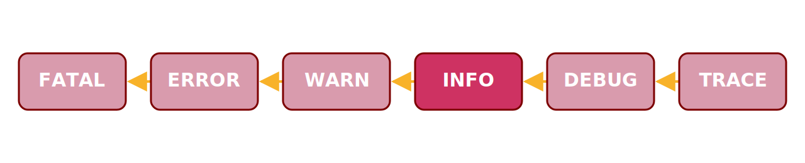
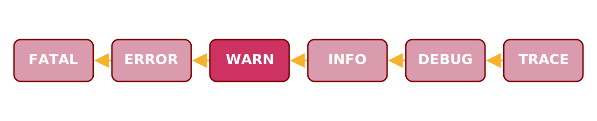
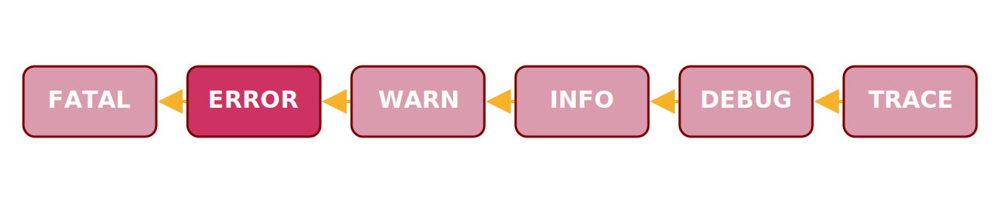

# เรื่อง Log เรื่องเล็ก เรื่องไม่ Log เรื่องใหญ่

```
Pallat Anchaleechamaikorn

Technical Coach
Infinitas by KrungThai
Arise by Infinitas
```

---
background: "#ffffff"
color: "#363636"
headerFont: "Roboto"
---

# The Ship's Log


---
background: "#ffffff"
color: "#363636"
headerFont: "Roboto"
---

# Is logging a requirement?

---
background: "#ffffff"
color: "#363636"
headerFont: "Roboto"
---


---
background: "#ffffff"
color: "#363636"
headerFont: "Roboto"
---

# Let's focus on debug logging

---
background: "#ffffff"
color: "#363636"
headerFont: "Roboto"
---

# Debug Logging Level



---
background: "#ffffff"
color: "#363636"
headerFont: "Roboto"
---

<style>
    th {
        background: #B5B2B3;
        word-wrap: break-word;
        text-align: center;
    }
    td:nth-child(1) { background: #FDDD00; }
</style>

| |FATAL|ERROR|WARN|INFO|DEBUG|TRACE|
|:-|:-:|:-:|:-:|:-:|:-:|:-:|
| **OFF** |||||||
| **FATAL** | x ||||||
| **ERROR** | x |x|||||
| **WARN** | x |x|x||||
| **INFO** | x |x|x|x|||
| **DEBUG** | x |x|x|x|x||
| **TRACE** | x |x|x|x|x|x|

---
background: "#ffffff"
color: "#363636"
headerFont: "Roboto"
fragments: true
---

# Choose the Right Log Level

- **DEBUG** Used in the development process
- **INFO** regular operation
- **WARN** system instability or connectivity issues
- **ERROR** runtime issues
- **FATAL** generally result in the shutdown

```
https://www.crowdstrike.com/cybersecurity-101/observability/debug-logging/
```

<!--
DEBUG: ใช้เฉพาะใน Dev En เพื่อวิเคราะห์แอป
INFO: ใช้แสดงว่าแอปทำงานได้ปกติหรือไม่ เช่น startup/shutdown
WARN: ปัญหา runtime ที่อาจจะไม่ส่งผลกระทบโดยตรง แต่อาจจะมีผลกระทบอื่นๆตามมา ส่วนมากเกี่ยวกับความเสภียร
ERROR:
FATAL: รุนแรงจนต้องระงับการทำงาน
-->

---
background: "#ffffff"
color: "#363636"
headerFont: "Roboto"
fragments: true
---

# DEBUG



```js
console.log('==========');
```

```js
console.log(err);
```

```js
DEBUG: Fetching mailing list {"listid":14777}
```

or `TRACE: Fetching mailing list {"listid":14777}`

or Unit Testing

---
background: "#ffffff"
color: "#363636"
headerFont: "Roboto"
fragments: true
---

# INFO



```sh
level=INFO msg=Connecting to the server...
```

```sh
level=INFO msg=No Content.
```

---
background: "#ffffff"
color: "#363636"
headerFont: "Roboto"
fragments: true
---

# WARN



```sh
level=WARN msg=WARNING WARNING WARNING
```

```sh
level=WARN msg=context deadline exceeded
```

or `level=ERROR msg=context deadline exceeded`

or add to metric

---
background: "#ffffff"
color: "#363636"
headerFont: "Roboto"
fragments: true
---

# ERROR



```sh
level=ERROR msg=Get "http://example.com/api": dial tcp: lookup example.co: no such host
```

How about if it's ok but http status is 404

---
background: "#ffffff"
color: "#363636"
headerFont: "Roboto"
---

# ERROR: but the response itself says 404

```xml
<?xml version="1.0" encoding="iso-8859-1"?>
<!DOCTYPE html PUBLIC "-//W3C//DTD XHTML 1.0 Transitional//EN"
         "http://www.w3.org/TR/xhtml1/DTD/xhtml1-transitional.dtd">
<html xmlns="http://www.w3.org/1999/xhtml" xml:lang="en" lang="en">
        <head>
                <title>404 - Not Found</title>
        </head>
        <body>
                <h1>404 - Not Found</h1>
                <script type="text/javascript" src="//obj.ac.bcon.ecdns.net/ec_tpm_bcon.js"></script>
        </body>
</html>
```

---
background: "#ffffff"
color: "#363636"
headerFont: "Roboto"
---

# Common Mistakes

- Ignoring important logs (Error without log)
- Use **Fatal** in libraries
- Logging at the wrong level
- Useless message
- Sensitive Information

---
background: "#ffffff"
color: "#363636"
headerFont: "Roboto"
fragments: true
---

# Common Mistakes

```go
slog.Error("not found")
```

```
time=2023-11-14T21:41:20.632+07:00 level=ERROR source=handler.go:25 msg=not found
```

```go
slog.Error("result failed")
```

```
time=2023-11-14T21:41:20.632+07:00 level=ERROR source=handler.go:25 msg=result failed
```

---
background: "#ffffff"
color: "#363636"
headerFont: "Roboto"
---

# 10 Rules to Microservice Logging

```
https://medium.com/@sniederm/10-rules-to-microservice-logging-4d24f6dd7abb
```

- Rule 1: Write your logs to console, not files
- Rule 2: Use a logging framework
- Rule 3: Log in JSON format where possible
- Rule 4: Centralize and index your logs
- Rule 5: Treat logs like event streams
- **Rule 6: Do not log sensitive and privacy data**
- Rule 7: Use common log levels (DEBUG, INFO, WARN, ERROR)
- Rule 8: Use a correlation / trace ID
- Rule 9: Use a reporting tool
- Rule 10: Keep an eye on complexity and performance

---
background: "#ffffff"
color: "#363636"
headerFont: "Roboto"
---

# Sesitive Data

- Personally Identifiable Information (PII)
- Financial Information
- Health and Medical Information
- Authentication Credentials
- Confidential Business Data
- Legal and Compliance Data
- Personal Communications
- Biometric Data

```
https://betterstack.com/community/guides/logging/sensitive-data/
```

---
background: "#ffffff"
color: "#363636"
headerFont: "Roboto"
---

Logging too much data can be distracting and a poor use of resources. Indeed, transferring, storing and parsing logs is expensive, so minimizing what the log files contains can minimize cost and resources. Still, logging is king, especially when it comes to traditional monolithic architectures

```
https://www.bmc.com/blogs/monitoring-logging-tracing/
```

---
background: "#ffffff"
color: "#363636"
headerFont: "Roboto"
---

# Who cares about this kind of message?

```sh
level=INFO msg=PaymentService - Payment processed successfully for Order #12345
```

---
background: "#ffffff"
color: "#363636"
headerFont: "Roboto"
fragments: true
---

# What's the log level in Production?

<strong style="color:red;">ERROR</strong>

<strong style="color:brown;">WARN</strong>

<strong style="color:blue;">INFO</strong>

<strong style="color:green;">DEBUG</strong>

---
background: "#ffffff"
color: "#363636"
headerFont: "Roboto"
---

# Cloud Cost

<https://cloud.google.com/blog/products/devops-sre/cloud-logging-cost-management-best-practices>

1. Analyze your current spending on logging tools
2. Eliminate waste — **don't pay for logs you don't need**
3. Optimize costs over the lifecycle of your logs
4. Setup alerts to avoid surprise bills

---
background: "#ffffff"
color: "#363636"
headerFont: "Roboto"
---

# Who needs it?
